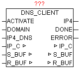

<!--
  Copyright (c) 2026 Hans Mühlbauer, Franz Höpfinger and others.

  This program and the accompanying materials are made available under the
  terms of the Eclipse Public License 2.0 which is available at
  https://www.eclipse.org/legal/epl-2.0

  SPDX-License-Identifier: EPL-2.0
-->

## DNS_CLIENT

| | | |
|:---|:---|:---|
| **Type** | Funktionsbaustein | |
| **IN_OUT	IP_C** | IP_C (Parametrierungsdaten) | |
| **S_BUF** | NETWORK_BUFFER (Sendedaten) | |
| **R_BUF** | NETWORK_BUFFER (Empfangsdaten) | |
| **INPUT	ACTIVATE** | BOOL | (Abfrage starten durch positive Flanke) |
| **DOMAIN** | STRING | (Domain Name oder IP als String) |
| **IP4_DNS** | DWORD (IPv4 Adresse des DNS-Server) | |
| **OUTPUT	IP4** | DWORD (IPv4 Adresse der angefragten Domain) | |
| **DONE** | BOOL (IP der Domain erfolgreich ermittelt) | |
| **ERROR** | DWORD (Fehlercode) | |
| | DNS_CLIENT ermittelt aus den übergebenen qualifizierten DOMAIN Namen die zugehörige IPv4 Adresse  z.B. „www.oscat.de“ . Dazu wird eine DNS-Abfrage über den parametrierten DOMAIN Namen bei einen DNS-Server gemacht. Bei positiver Flanke von ACTIVATE wird die angegebene DOMAIN zwischen gespeichert, so dass diese nicht länger vorhanden sein muss. Sollte die Abfrage mehrere IP-Adressen liefern, so wird immer die mit dem höchsten Wert von TTL (Time To Live) benutzt. Als IP4_DNS kann ein beliebiger öffentlicher DNS-Server verwendet werden. Wenn die SPS hinter einen DSL-Router sitzt, kann  dieser über seine Gateway-Adresse dieser als DNS-Server verwendet werden. Was letztendlich auch bei wiederkehrenden Abfragen zu schnelleren Antwortzeiten führt, da diese im Router-Cache verwaltet werden. Bei positiven Ergebnis DONE = TRUE enthält IP4 die gesuchte IP-Adresse, bis zum Start der nächsten Abfrage durch positive Flanke von ACTIVATE. Wird im DOMAIN Name eine gültige IPv4 Adresse erkannt, wird logischerweise keine DNS-Abfrage mehr durchgeführt und gleich in konvertierter Form wieder bei IPv4 ausgegeben und DONE auf TRUE gesetzt. ERROR liefert im Fehlerfall die genaue Ursache. | |
| **Fehlercodes** |  | |

| Wert | Ursprung | Beschreibung |
| --- | --- | --- |
| B3 | B2 | B1 | B0 |  |  |
| nn | nn | nn | xx | IP_CONTROL | Fehler vom Baustein IP_CONTROL |
| xx | xx | xx | 00 | DNS_CLIENT | No error: The request completed successfully |
| xx | xx | xx | 01 | DNS_CLIENT | Format error: The name server was unable to interpret the query. |
| xx | xx | xx | 02 | DNS_CLIENT | Server failure: The name server was unable to process this query due to a problem with the name server. |
| xx | xx | xx | 03 | DNS_CLIENT | Name Error: Meaningful only for responses from an authoritative name server, this code signifies that the domain name referenced in the query does not exist |
| xx | xx | xx | 04 | DNS_CLIENT | Not Implemented: The name server does not support the requested kind of query |
| xx | xx | xx | 05 | DNS_CLIENT | Refused: The name server refuses to perform the specified operation for policy reasons |
| xx | xx | xx | 06 | DNS_CLIENT | YXDomain: Name Exists when it should not |
| xx | xx | xx | 07 | DNS_CLIENT | YXRRSet. RR: Set Exists when it should not |
| xx | xx | xx | 08 | DNS_CLIENT | NXRRSet. RR: Set that should exist does not |
| xx | xx | xx | 09 | DNS_CLIENT | Server Not Authoritative for zone |
| xx | xx | xx | 0A | DNS_CLIENT | Name not contained in zone |
| xx | xx | xx | FF | DNS_CLIENT | No ip-address found |
