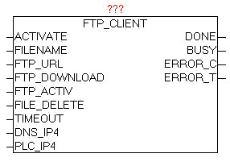

<!--
  Copyright (c) 2026 Hans Mühlbauer, Franz Höpfinger and others.

  This program and the accompanying materials are made available under the
  terms of the Eclipse Public License 2.0 which is available at
  https://www.eclipse.org/legal/epl-2.0

  SPDX-License-Identifier: EPL-2.0
-->

## FTP_CLIENT

| | |
|:---|:---|
| **Type	Funktionsbaustein** |  |
| **INPUT	ACTIVATE** | BOOL (positive Flanke startet die Abfrage) |
| **FILENAME** | STRING (Dateipfad / Dateiname) |
| **FTP_URL** | STRING(STRING_LENGTH) (FTP Zugriffspfad) |
| **FTP_DOWNLOAD** | BOOL (UPLOAD = 0 / DOWNLOAD = 1) |
| **FTP_ACTIV** | BOOL (PASSIV = 0 / ACTIV = 1) |
| **FILE_DELETE** | BOOL (Datei nach Übertragung löschen) |
| **TIMEOUT** | TIME (Zeitüberwachung) |
| **DNS_IP4** | DWORD (IP4-Adresse des DNS-Server) |
| **PLC_IP4** | DWORD (IP4-Adresse der eigenen Steuerung) |
| **OUTPUT	DONE** | BOOL  (Transfer ohne Fehler beendet) |
| **BUSY** | BOOL  (Transfer ist aktiv) |
| **ERROR_C** | DWORD  (Fehlercode) |
| **ERROR_T** | BYTE  (Fehlertype) |
| **Der Baustein FTP_CLIENT dient zum übertragen von Dateien von der SPS zu einen FTP-Server, und zum übertragen vom FTP-Server zur SPS. Mittels positiver Flanke bei ACTIVATE wird der Übertragungsvorgang gestartet. Bei FTP_DOWNLOAD kann die Übertragungsrichtung vorgegeben werden. Der Parameter FTP_URL enthält den Namen des FTP-Server und optional den Benutzernamen und das Passwort, einen Zugriffpfad und eine zusätzliche Portnummer für den Datenkanal.Wird kein Benutzername bzw. Passwort übergeben, so versucht der Baustein sich automatisch als „Anonymous“ anzumelden. Der Parameter FTP_ACTIV bestimmt ob der FTP-Server im AKTIV oder PASSIV Modus betrieben wird. Im ACTIV Modus versucht der FTP-Server den Datenkanal zur Steuerung aufzubauen, dabei kann es jedoch durch Sicherheitssoftware, Firewall etc. zu Problemen kommen , da diese die Verbindungswunsch blockieren könnten. Hierzu müsste in der Firewall eine dementsprechende Ausnahmeregel definiert werden. Beim PASSIV Modus wird dieses Problem entschärft, da die Steuerung die Verbindung aufbaut, und somit problemlos die Firewall passieren kann. Der Steuerkanal wird immer über PORT 20 aufgebaut, und der Datenkanal standardmäßig über PORT21, dies ist aber wiederum abhängig ob ACTIV oder PASSIV Mode genutzt wird, bzw. optional eine  PORT-Nummer in der FTP-URL angegeben wurde. Mit dem Parameter FILE_DELETE kann bestimmt werden, ob die Quell-Datei nach erfolgreicher Übertragung gelöscht werden soll. Dies funktioniert auf FTP als auch auf der Steuerungsseite. Bei Vorgabe von FTP-Verzeichnissen ist das Verhalten FTP-Server abhängig, ob hierbei diese schon existieren müssen, oder automatisch angelegt werden. Im Normalfall sollten diese schon vorhanden sein. Die Größe der Dateien ist an sich unbegrenzt, jedoch gibt es hier praktische Limits** | Speicher auf SPS, FTP-Speicher und der Faktor Übertragungszeit. Bei DNS_IP4 muss die IP-Adresse des DNS-Servers angegeben werden, wenn in der FTP-URL ein DNS-Name angegeben wird, alternativ kann in der FTP-URL auch eine IP-Adresse eingetragen werden. Bei Parameter PLC_IP4 muss die eigene IP-Adresse angegeben werden. Sollten bei der Übertragung Fehler auftreten werden diese bei ERROR_C und ERROR_T ausgegeben. Solange die Übertragung läuft ist BUSY = TRUE, und nach fehlerfreien Abschluss des Vorgangs wird DONE = TRUE. Sobald ein neuer Übertragungsvorgang gestartet wird, werden DONE,ERROR_T und ERROR_C rückgesetzt. |
| | Der Baustein hat den IP_CONTROL integriert und muss somit nicht mehr extern mit diesen verknüpft werden, so wie dies normalerweise notwendig wäre. |
| **Grundlagen** | http://de.wikipedia.org/wiki/File_Transfer_Protocol |
| **URL-Beispiele** |  |
| **ftp** | //benutzername:password@servername:portnummer/verzeichnis/ |
| **ftp** | //benutzername:password@servername |
| **ftp** | //benutzername:password@servername/verzeichnis/ |
| **ftp** | //servername |
| **ftp** | //benutzername:password@192.168.1.1/verzeichnis/ |
| **ftp** | //192.168.1.1 |
| **ERROR_T** |  |

| Wert | Eigenschaften |
| --- | --- |
| 1 | Störung: DNS_CLIENTDie genaue Bedeutung von ERROR_C ist beim Baustein DNS_CLIENT nachzulesen |
| 2 | Störung: FTP SteuerkanalDie genaue Bedeutung von ERROR_C ist beim Baustein IP_CONTROL nachzulesen |
| 3 | Störung: FTP DatenkanalDie genaue Bedeutung von ERROR_C ist beim Baustein IP_CONTROL nachzulesen |
| 4 | Störung: FILE_SERVERDie genaue Bedeutung von ERROR_C ist beim Baustein FILE_SERVER nachzulesen |
| 5 | Störung: ABLAUF – TIMEOUTERROR_C enthält im linken WORD die Ablauf-Schrittnummer, und im rechten WORD den zuletzt vom FTP-Server empfangenen Response-Code.Achtung der Parameter muss zuerst als HEX-Wert betrachtet, in zwei WORDS geteilt werden,und dann als Dezimalzahl betrachtet werden. Beispiel:ERROR_T = 5ERROR_C = 0x0028_00DCAblauf-Schrittnummer 0x0028 = 40Response-Code 0x00DC = 220 |
