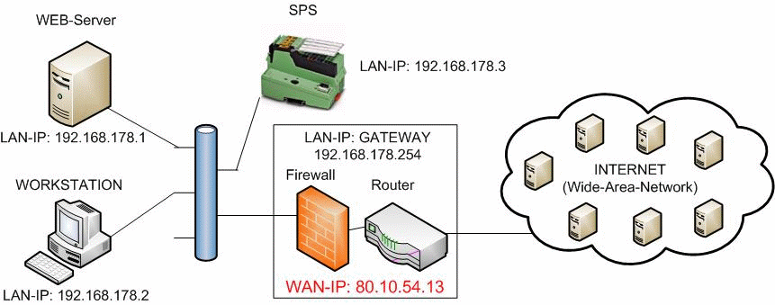

<!--
  Copyright (c) 2026 Hans Mühlbauer, Franz Höpfinger and others.

  This program and the accompanying materials are made available under the
  terms of the Eclipse Public License 2.0 which is available at
  https://www.eclipse.org/legal/epl-2.0

  SPDX-License-Identifier: EPL-2.0
-->

## Type	Funktionsbaustein:

| | |
|:---|:---|
| **INPUT	ACTIVATE** | BOOL (Freigabe zur Abfrage) |
| **OUTPUT** | WAN_IP: DWORD (Wide-Area-Network-Adresse) |
| **DONE** | BOOL  (Abfrage ohne Fehler beendet) |
| **ERROR_C** | DWORD  (Fehlercode) |
| **ERROR_T** | BYTE  (Fehlertype) |
| | Der Baustein stellt die IP-Adresse fest, die der Internet-Routers im Wide-Area-Network (Internet) benutzt. Diese IP-Adresse ist z.B. notwendig um  DynDNS Anmeldungen durchführen zu können. Mit einer positiven Flanke von ACTIVATE wird die Abfrage gestartet. Nach erfolgreich beendeter Abfrage wird DONE=TRUE ausgegeben, und bei Parameter WAN_IP wird die aktuelle  WAN-IP Adresse ausgegeben. Sollte bei der Abfrage ein Fehler auftreten so wird dieser unter ERROR_C gemeldet in Kombination mit ERROR_T. |
| **ERROR_T** |  |

IN_OUT	IP_C : Datenstruktur 'IP_CONTROL'  (Parametrierungsdaten)

S_BUF: Datenstruktur 'NETWORK_BUFFER' (Sendedaten)

R_BUF: Datenstruktur 'NETWORK_BUFFER' (Empfangsdaten)

| Wert | Eigenschaften |
| --- | --- |
| 1 | Die genaue Bedeutung von ERROR_C ist beim Baustein DNS_CLIENT nachzulesen |
| 2 | Die genaue Bedeutung von ERROR_C ist beim Baustein HTTP_GET nachzulesen |
