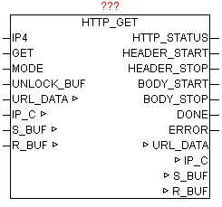

<!--
  Copyright (c) 2026 Hans Mühlbauer, Franz Höpfinger and others.

  This program and the accompanying materials are made available under the
  terms of the Eclipse Public License 2.0 which is available at
  https://www.eclipse.org/legal/epl-2.0

  SPDX-License-Identifier: EPL-2.0
-->

## HTTP_GET

| | |
|:---|:---|
| **Type	Funktionsbaustein** |  |
| **IN_OUT	URL_DATA** | URL (Daten von STRING_TO_URL) |
| **IP_C** | IP_C (Parametrierungsdaten) |
| **S_BUF** | NETWORK_BUFFER (Sendedaten) |
| **R_BUF** | NETWORK_BUFFER (Empfangsdaten) |
| **INPUT	IP4** | DWORD (IP-Adresse des HTTP-Servers) |
| **GET** | BOOL (Startet die HTTP Abfrage) |
| **MODE** | BYTE (Version der HTTP-GET Abfrage) |
| **UNLOCK_BUF** | BOOL (Freigabe des Empfangs-Datenbuffers) |
| **OUTPUT	HTTP_STATUS** | STRING (ermittelter HTTP Statuscode) |
| **HTTP_START** | UINT (Start-Position des Message-Headers) |
| **HTTP_STOP** | UINT (Stopp-Position des Message-Headers) |
| **BODY_START** | UINT (Start-Position des Message-Body) |
| **BODY_STOP** | UINT (Stopp-Position des Message-Body) |
| **DONE** | BOOL (Aufgabe ohne Fehler durchgeführt) |
| **ERROR** | DWORD (Fehlercode) |
| | HTTP_GET führt nach positiver Flanke von GET ein GET-Kommando auf einem HTTP-Server durch. Mittels MODE kann die HTTP Protokollversion vorgegeben werden. Die gewünschte URL (Web-Link) muss vorab in der URL_DATA Struktur fertig aufbereitet vorliegen. Die vollständige URL sollte darum vor dem Bausteinaufruf mittels „STRING_TO_URL“ aufbereitet werden. Nach erfolgreicher Abfrage wird DONE = TRUE ausgegeben, und die Parameter HTTP_START und HTTP_STOP zeigen auf den Datenbereich in dem die Message-Header Daten zur weiteren Bearbeitung und Auswertung vorzufinden sind. Im Normalfall ist auch ein Message-Body vorhanden, der wiederum mittels BODY_START und BODY_STOP übermittelt wird. Weiters wird auf HTTP_STATUS der zurückgemeldete HTTP-Statuscode als String ausgegeben. Eine der Schwierigkeiten beim HTTP Empfang ist das erkennen vom Ende des Datenstream. Dabei werden vom Baustein mehrere Strategien verfolgt. Bei Anwendung von HTTP/1.0 wird das Ende des Datenempfangs über einen Verbindungsabbau seitens des Host erkannt. Weiters wird immer geprüft ob sich im Header die Info „Content-Length“ befindet, damit kann dann eindeutig erkannt werden ob alle Daten empfangen wurden. Trifft keines der vorigen Varianten zu, so wird über einen einfachen Receive-Timeout Error das Ende der Datenübertragung festgestellt und beendet. Einziger Nachteil dabei ist, das dies je nach eingestellte Timeout Zeit mitunter länger dauert als gewünscht. Darum ist es nicht schlecht wenn eine vernünftiger Timeout-Wert am IP_CONTROL gewählt wird. ERROR liefert im Fehlerfall die genaue Ursache (Siehe Baustein IP_CONTROL). |
| **Das „Chunked transfer encoding“ wird vom Baustein nicht unterstützt (https** | //en.wikipedia.org/wiki/Chunked_transfer_encoding) |
| **HTTP-Authentifizierung** |  |
| | Der Baustein unterstützt die Authentifizierung über Basic Authentication |
| **wie z.B.  benutzername** | password@serveradresse/login/main.php |
| | SSL/TLS Verschlüsselung |
| | SSL steht für Secure Socket Layer |
| | TLS bedeutet Transport Layer Security |
| | SSL |
| | Die Kommunikation zwischen Client und Server beginnt sofort verschlüsselt. Der meistens benutzte Standardport ist Port 443 |
| | Hinweis ! |
| | Die SSL/TLS Verschlüsselung wird aktuell nur für Steuerungen von Fa. Phoenix Contact unterstützt. Um diese Funktionalität nutzen zu können muss die SPS eine Firmware haben die SSL/TLS unterstützt. |
| | Für die Aktivierung muss dieURL Adresse mit HTTPS beginnen |
| | z.B. |
| **https** | //benutzername:password@serveradresse/login/main.php |
| **Https** | //serveradresse/login/main.php |
| **HTTPS** | //serveradresse.at |
| **Folgende MODE können verwendet werden** |  |

| Mode | Protokollversion | Eigenschaften |
| --- | --- | --- |
| 0 | HTTP/1.0 | Der Host beendet selbstständig nach Übertragung der Daten die TCP-Verbindung |
| 1 | HTTP/1.0 | Durch Anwendung von „Connection: Keep-Alive“ wird der Host angewiesen eine persistente Verbindung zu verwenden. Der Client sollte nach Ende der Aktivitäten die Verbindung wieder abbauen. |
| 2 | HTTP/1.1 | Der Host verwendet eine persistente Verbindung und muss von Client beendet werden. |
| 3 | HTTP/1.1 | Durch Anwendung von „Connection: Close“ wird der Host angewiesen nach Übertragung der Daten die TCP-Verbindung zu beenden. |
