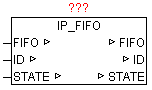

<!--
  Copyright (c) 2026 Hans Mühlbauer, Franz Höpfinger and others.

  This program and the accompanying materials are made available under the
  terms of the Eclipse Public License 2.0 which is available at
  https://www.eclipse.org/legal/epl-2.0

  SPDX-License-Identifier: EPL-2.0
-->

## IP_FIFO

| | |
|:---|:---|
| **Type	Funktionsbaustein** |  |
| **IN_OUT	FIFO** | IP_FIFO_DATA  (IP-FIFO Verwaltungsdaten) |
| **ID** | BYTE (aktuelle vom IP_FIFO-Baustein vergebene ID) |
| **STATE** | BYTE (Steuerbefehle und Statusmeldungen) |
| | Dieser Baustein dient in Kombination mit IP_CONTROL zur Ressourcen-Verwaltung. Damit ist es möglich das Client-Applikation die alleinigen Zugriffsrechte anfordern  und auch wieder abgeben können. Durch das FIFO wird gewährleistet das jeder Teilnehmer gleich oft den Ressourcen-Zugriff zugeteilt bekommt. |
| | Bei ersten Aufruf des Bausteins wird automatisch eine neue eindeutige Applikation-ID vergeben, mittels der dann die Verwaltung im FIFO durchgeführt wird. Der Parameter STATE wird von der Applikation als auch vom IP_FIFO Baustein verändert. Jede Applikation kann sich in der Standardeinstellung nur einmal im FIFO eintragen. |
| **STATE** |  |
| **Ablauf** |  |
| | 1. Applikation setzt STATE auf 1 |
| | 2. Zugriffsrechte werden angefordert, während dessen ist STATE=2 |
| | 3. wenn Ressource frei ist,  und Zugriffsrechte vorhanden sind, dann ist  STATE=3 |
| | 4. Wenn die Applikation die Ressource bzw. den Zugriff nicht mehr benötigt,wird von der Applikation STATE auf 4 gesetzt. Danach gibt IP_FIFO die Ressource wieder frei und setzt STATE auf 5. |
| | 5. Vorgang wiederholt sich (gleicher oder anderer Applikation) |
| | Anwendungsbeispiel ist beim Baustein IP_CONTROL zu finden ! |

| Wert | Zustandsmeldung |
| --- | --- |
| 0 | Keine Aktion |
| 1 | Zugriffsrecht anfordern |
| 2 | Zugriffsrecht anfordern wurde in FIFO übernommen |
| 3 | Zugriffsrecht erhalten (Ressourcen-Zugriff erlaubt) |
| 4 | Zugriffsrecht abgeben |
| 5 | Zugriffsrecht wurde aus FIFO wieder entfernt |
