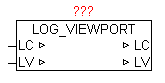

<!--
  Copyright (c) 2026 Hans Mühlbauer, Franz Höpfinger and others.

  This program and the accompanying materials are made available under the
  terms of the Eclipse Public License 2.0 which is available at
  https://www.eclipse.org/legal/epl-2.0

  SPDX-License-Identifier: EPL-2.0
-->

## LOG_VIEWPORT

| | |
|:---|:---|
| **Type** | Funktionsbaustein |
| **IN_OUT	LC** | LOG_CONTROL |
| **LV** | us_LOG_VIEWPORT |
| **Der Baustein LOG_VIEWPORT dient zum erzeugen einer Indexliste der LOG_CONTROL Meldungen die sich aktuell in der virtuellen Ansicht befinden. Um sich innerhalb der Meldungsliste zu bewegen (scrollen) kann über LV.MOVE_TO_X ein Scroll-offset angegeben werden. Ein positiver Wert  scrollt in richtig neuere Meldungen und ein negativer Wert in richtig der älteren Meldungen. Die Anzahl der Zeilen der Meldungsliste der virtuellen Ansicht wird über LV.COUNT vorgegeben. Die in der aktuellen virtuellen Ansicht sich befindenden Meldungen werden in LV.LINE_ARRAY[x] abgelegt, und stehen für die weitere Verarbeitung zu Verfügung. Eine Veränderung der Meldungsliste wird immer mit LV.UPDATE** | = TRUE signalisiert, und muss vom Anwender wieder rückgesetzt werden. |
| | Folgende LV.MOVE_TO_X Werte erzeugen ein spezielles Verhalten. |
| | +30000 = älteste Meldungen anzeigen (Anfang des Ringbuffer) |
| | +30001 = neueste Meldungen anzeigen (Ende des Ringbuffer) |
| | +30002 = eine ganze Seite in Richtig neuere Meldungen scrollen |
| | +30003 = eine ganze Seite in Richtig ältere Meldungen scrollen |

