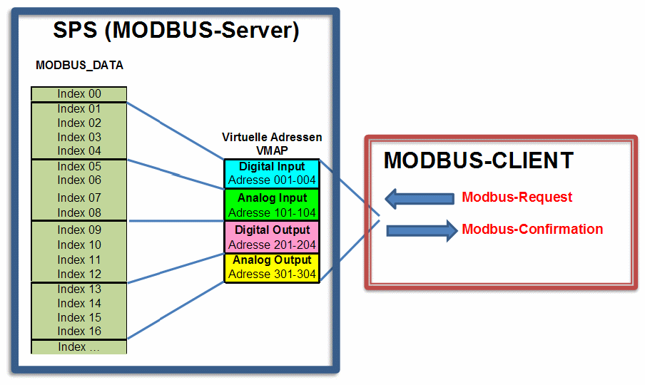

<!--
  Copyright (c) 2026 Hans Mühlbauer, Franz Höpfinger and others.

  This program and the accompanying materials are made available under the
  terms of the Eclipse Public License 2.0 which is available at
  https://www.eclipse.org/legal/epl-2.0

  SPDX-License-Identifier: EPL-2.0
-->

## MB_VMAP

| | |
|:---|:---|
| **Type	Funktionsbaustein** |  |
| **IN_OUT	VMAP** | ARRAY [1..10] OF VMAP_DATA (VIRTUAL_MAP Daten) |
| **INPUT	FC** | INT (Funktionsnummer) |
| **V_ADR** | INT (Virtuelle Adressbereich: Startadresse) |
| **V_CNT** | INT (Virtuelle Adressbereich: Anzahl der Datenpunkte) |
| **SIZE** | INT (Anzahl der MODBUS-Register in Struktur DATA) |
| **OUTPUT** | P_ADR: INT (Realer Adressbereich: Startadresse) |
| **P_BIT** | INT (Realer Adressbereich: Bitposition) |
| **ERROR** | DWORD (Fehlercode) |
| | Der Baustein ermöglicht die Umrechnung von Virtuellen Adressen auf einen Realen Adressbereich im der MODBUS-DATA  Struktur. Dazu werden im VMAP-Datenarray Virtuelle Adressbereiche definiert. Wird der Baustein aufgerufen und dabei festgestellt das in den VMAP-Daten nichts eingetragen ist, wird automatisch ein Block angelegt, der den vollen Zugriff auf die ganzen MODBUS-Daten ermöglicht. In jedem Adressblock wird ein auch Watchdog-Timer verwaltet, der bei jedem Zugriff über diesem Block den Timer auf Null setzt. Somit kann einfach durch vergleichen des TIME_OUT Wertes mit einem Abschaltwert auf Kommunikationsstörungen (keine Aktualisierung) reagiert werden. |
| | Mittels dem Parameter FC wird erkannt um welchen Funktionscode es sich handelt, und ob dabei Register (16Bit) oder einzelne Bits behandelt werden müssen. Die Bitnummer entspricht dem Funktionscode. Das heißt  das z.B. BIT5=1 in FC den Funktionscode 5 (Write Single Coil) aktiviert.  Durch V_ADR wird die virtuelle Startadresse angegeben (Bei 16Bit Befehlen ist dies eine Register-Adresse und bei Bit Befehlen eine absolute Bitnummer innerhalb eines definierten Blocks. Der Parameter V_CNT definiert die Anzahl der Datenpunkte (Einheit 16 Bit oder Bit je nach Funktionscode). Die Gesamtgröße des MODBUS_ARRAY wird über SIZE (Anzahl WORDS) vorgegeben. Anhand dieser Parameter durchsucht der Baustein die VMAP Datentabelle nach einen passenden Datenblock, und gibt vom ersten korrekten Datenblock die P_ADR als Ergebnis zurück. Der Wert entspricht den realen Index für MODBUS_DATA Array. Bei einem Funktionscode mit Bit Zugriff wird noch zusätzlich die Bit-Position innerhalb P_ADR mit ausgegeben. Ein möglicherweise auftretender Fehler bei der Auswertung wird beim Parameter „Error“ gemeldet (Siehe Error-Tabelle). Der Watchdog-Timer wird bei jeden Zugriff mit einem Funktionscode aus der Gruppe der schreibenden Kommandos zurückgestellt. |
| **Wird keine Sonderbehandlung gewünscht so sind in VMAP keinerlei Einstellungen notwendig, und das MODBUS_ARRAY wird dann 1** | 1 beim Zugriff abgebildet. |
| **ERROR** |  |
| | ! Hinweis zur Sonderbehandlung des Funktionscode 23 ! |
| | Der Modbus-Funktionscode 23 ist ein kombinierter Befehl, weil er aus zwei Aktionen besteht. Zuerst werden Register geschrieben, und danach Register gelesen. Wird festgestellt das Schreib oder Lese-Parameter nicht zulässig sind, so wird keine der beiden Aktionen durchgeführt. |
| | Damit über VMAP auch zwischen dem Lesen und Schreiben unterschieden werden kann, wird der Lesebefehl in VMAP bei FC 23 als BIT23 (Read/Write Multiple Register) , und der Schreibbefehl hingegen über BIT16 (Write Multiple Register) geprüft. |

**Beispiel:**

Beispielkonfiguration

(* Virtueller Block 1 *)

VMAP[1].FC := DWORD#2#00000000_10000000_00000000_00011100); (FC 2,3,4,23)

VMAP[1].V_ADR := 1;	(* Virtueller Adressbereich: Startadresse *)

VMAP[1].V_SIZE := 4;	(* Virtueller Adressbereich: Anzahl der WORD *)

VMAP[1].P_ADR := 1;	(* Realer Adressbereich: Startadresse *)

(* Virtueller Block 2 *)

VMAP[2].FC := DWORD#2#00000000_10000000_00000000_00011000); (FC 3,4,23)

VMAP[2].V_ADR := 101;(* Virtueller Adressbereich: Startadresse *)

VMAP[2].V_SIZE := 4;	(* Virtueller Adressbereich: Anzahl der WORD *)

VMAP[2].P_ADR := 5;	(* Realer Adressbereich: Startadresse *)

(* Virtueller Block 3 *)

VMAP[3].FC := DWORD#2#00000000_11000001_10000000_01111010);(FC1,3-6,15-16,23)

VMAP[3].V_ADR := 201;(* Virtueller Adressbereich: Startadresse *)

VMAP[3].V_SIZE := 4;	(* Virtueller Adressbereich: Anzahl der WORD *)

VMAP[3].P_ADR := 9;	(* Realer Adressbereich: Startadresse *)

(* Virtueller Block 4 *)

VMAP[4].FC := DWORD#2#00000000_11000001_00000000_01011000); (FC 3,4,6,16,23)

VMAP[4].V_ADR := 301;(* Virtueller Adressbereich: Startadresse *)

VMAP[4].V_SIZE := 4;	(* Virtueller Adressbereich: Anzahl der WORD *)

VMAP[4].P_ADR := 12;	(* Realer Adressbereich: Startadresse *)

Die Konfiguration ergibt folgende Zugriffs-Matrix:

| Wert | Beschreibung |
| --- | --- |
| 0 | Keine Fehler |
| 1 | Ungültiger Funktionscode |
| 2 | Ungültige Datenadresse |

| Funktion Beschreibung | Funktionscode | Bit Zugriff | 16 Bit Zugriff (Register) | Lesen / Schreiben | Digital Input | Analog Input | Digital Output | Analog Output |
| --- | --- | --- | --- | --- | --- | --- | --- | --- |
| Read Coils | 1 | x |  | Lesen |  |  | x |  |
| Read Discrete Inputs | 2 | x |  | Lesen | x |  |  |  |
| Read Holding Registers | 3 |  | x | Lesen | x | x | x | x |
| Read Input Register | 4 |  | x | Lesen | x | x | x | x |
| Write Single Coil | 5 | x |  | Schreiben |  |  | x |  |
| Write Single Register | 6 |  | x | Schreiben |  |  | x | x |
| Write Multiple Coils | 15 | x |  | Schreiben |  |  | x |  |
| Write Multiple Register | 16 |  | x | Schreiben |  |  | x | x |
| Mask Write Register | 22 |  | x | Schreiben |  |  |  |  |
| Read/Write Multiple Register | 23 |  | x | Lesen / Schreiben | x | x | x | x |
