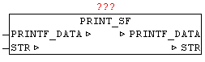

<!--
  Copyright (c) 2026 Hans Mühlbauer, Franz Höpfinger and others.

  This program and the accompanying materials are made available under the
  terms of the Eclipse Public License 2.0 which is available at
  https://www.eclipse.org/legal/epl-2.0

  SPDX-License-Identifier: EPL-2.0
-->

## PRINT_SF

| | | |
|:---|:---|:---|
| **Type	Funktionsbaustein** |  | |
| **IN_OUT	PRINTF_DATA** | ARRAY[1..11] OF STRING(STRING_LENGTH) | (Parameterdaten) |
| **STR** | STRING(STRING_LENGTH) (Ergebnisstring) | |
| | Mit PRINT_SF kann ein STRING mit Teilstrings dynamisch ergänzt werden. Die Position der einzufügenden Teilstrings wird mittels '~' Tilde Zeichen angegeben und die nachfolgenden Nummer definiert die Parameternummer. '~1' bis '~9' werden somit automatisch verarbeitet. Wird beim einfügen des Teilstrings die maximale Anzahl an Zeichen erreicht so wird anstatt des Teilstring nur mit '..' eingefügt. | |
| | VAR | |
| **LITER** | REAL := 545.4; | |
| **FUELLZEIT** | INT := 25; | |
| **NAME** | STRING := 'Tankinhalt'; | |
| **PARA** | ARRAY[1..11] OF STRING(STRING_LENGTH); | |
| **PS** | PRINT_SF; | |
| | END_VAR | |
| **PARA[1]** | = REAL_TO_STRING(Liter); (* Parameter 1: in String wandeln *) | |
| **PARA[2]** | = INT_TO_STRING(Fuellzeit); (* Parameter 2: in String wandeln *) | |
| **PARA[3]** | = NAME; (* Parameter 3: *) | |
| **PS.STR** | = '~3: ~1 Liter, Füllzeit: ~2 Min.'; (* Textausgabe-Maske *) | |
| **PS.PRINTF_DATA** | = PARA; (* Parameter Datenstruktur übergeben *) | |
| | PS(); (* Baustein ausführen *) | |
| | Der String PS.STR hat danach folgenden Inhalt | |
| **'Tankinhalt** | 545.4 Liter, Füllzeit: 25 Min.' | |

