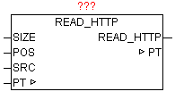

<!--
  Copyright (c) 2026 Hans Mühlbauer, Franz Höpfinger and others.

  This program and the accompanying materials are made available under the
  terms of the Eclipse Public License 2.0 which is available at
  https://www.eclipse.org/legal/epl-2.0

  SPDX-License-Identifier: EPL-2.0
-->

## READ_HTTP

| | | |
|:---|:---|:---|
| **Type	Funktionsbaustein** |  | |
| **INPUT	SIZE** | UINT | (Größe des Puffers) |
| **POS** | INT | (Position ab der gesucht wird) |
| **SRC** | STRING | (Suchstring) |
| **IN_OUT	PT** | POINTER | (Adresse des Puffers) |
| **OUTPUT** | VALUE		(Parameter der Header-Information) | |
| | Nach einem erfolgreichem HTTP-GET Request sind immer ein HTTP-Header (Message Header) und ein Nachrichtenkörper (Message Body) im Buffer vorhanden. Im HTTP-Header sind diverse Informationen zur angefragten HTTP-Seite abgelegt. Der nachfolgende Nachrichtenkörper beinhaltet die eigentlichen angefragten Daten. Mittels READ_HTTP können die HTTP-Header-Informationen ausgewertet werden. Der Baustein durchsucht ein beliebiges Array of Byte auf den Inhalt einer Zeichenkette und wertet danach den nachfolgenden Parameter aus, und liefert diesen String als Ergebnis zurück. Die Daten im Buffer werden automatisch auf Großbuchstaben konvertiert, daher müssen auch alle Suchstring bei SRC in Großbuchstaben übergeben werden. Mit POS kann an beliebiger Position mit der Suche begonnen werden. Das erste Element im Array hat die Positionsnummer 1. | |

**Beispiel:**

Beispiel einer HTTP-Response (Header-Informationen):

HTTP/1.0 200 OK<CR><LF>

Content-Length: 2165<CR><LF>

Content-Type: text/html<CR><LF>

Date: Mon, 15 Sep 2008 16:59:08 GMT<CR><LF>

Last-Modified: Wed, 18 Jun 2008 12:35:52 GMT<CR><LF>

Mime-Version: 1.0<CR><LF><CR><LF>

Wenn SRC keinen Suchbegriff beinhaltet, wird automatisch die HTTP Version und der HTTP Statuscode im Buffer besucht und ausgewertet. Als Ergebnis wird nach obigen Beispiel „1.0 200 OK“ zurückgegeben. Ist in SRC ein Suchbegriff enthalten wird diese Header-Information im Buffer gesucht und der Wert als String zurückgegeben z.B. 'Content-Length' = „2165“.
