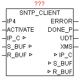

<!--
  Copyright (c) 2026 Hans Mühlbauer, Franz Höpfinger and others.

  This program and the accompanying materials are made available under the
  terms of the Eclipse Public License 2.0 which is available at
  https://www.eclipse.org/legal/epl-2.0

  SPDX-License-Identifier: EPL-2.0
-->

## SNTP_CLIENT

| | |
|:---|:---|
| **Type	Funktionsbaustein** |  |
| **IN_OUT	IP_C** | IP_C (Parametrierungsdaten) |
| **S_BUF** | NETWORK_BUFFER (Sendedaten) |
| **R_BUF** | NETWORK_BUFFER (Empfangsdaten) |
| **INPUT	IP4** | DWORD (IP-Adresse des SNTP-Servers) |
| **ACTIVATE** | BOOL (Startet die Abfrage) |
| **OUTPUT	ERROR** | DWORD (Fehlercode) |
| **DONE_P** | BOOL (positiver Flanke Fertig ohne Fehler) |
| **UDT** | DT (Datums und Zeit Ausgang als Weltzeit) |
| **XMS** | INT (Millisekunden der Weltzeit UDT) |
| | Der SNTP_CLIENT dient zum synchronisieren der lokalen Uhrzeit mit einem SNTP-Server. Dazu wird das Simple-Network-Time-Protokoll verwendet, das speziell entwickelt wurde , um eine zuverlässige Zeitangabe über Netzwerke mit variabler Paketlaufzeit zu ermöglichen. Das SNTP ist Datentechnisch völlig identisch mit NTP, das heißt hier bestehen keinerlei Unterschiede. Somit können sämtliche gekannte SNTP und NTP Server ob im lokalen Netzwerk als auch über das Internet genutzt werden. Bei IP4 wird die IP-Adresse eines SNTP/NTP Server angegeben. Eine positive Flanke bei ACTIVATE startet die Abfrage. Die vergangene Zeit zwischen Senden und dem Empfang der Zeit wird gemessen und daraus wird eine Zeitkorrektur errechnet. Danach wird die empfangene Zeit wird um diesen Wert korrigiert. Bei erfolgreicher Beendigung gibt DONE_P eine positiven Flanke aus, und die aktuelle Zeit wird bei UDT ausgegeben. Weiters werden auf XMS noch die zugehörigen Sekundenbruchteile als Millisekunden ausgegeben. Die Werte von UDT und XMS sind nur bei DONE_P = TRUE gültig, da es sich um einen statischen Uhrzeitwert handelt, und dienen nur zum Impuls gesteuerten Uhrzeitstellen. ERROR liefert im Fehlerfall die genaue Ursache (Siehe Baustein IP_CONTROL). |

