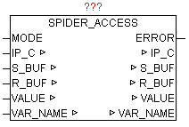

<!--
  Copyright (c) 2026 Hans Mühlbauer, Franz Höpfinger and others.

  This program and the accompanying materials are made available under the
  terms of the Eclipse Public License 2.0 which is available at
  https://www.eclipse.org/legal/epl-2.0

  SPDX-License-Identifier: EPL-2.0
-->

## SPIDER_ACCESS

| | |
|:---|:---|
| **Type	Funktionsbaustein** |  |
| **IN_OUT	IP_C** | IP_C (Parametrierungsdaten) |
| **S_BUF** | NETWORK_BUFFER (Sendedaten) |
| **R_BUF** | NETWORK_BUFFER (Empfangsdaten) |
| **VALUE** | STRING  (Wert der Variable) |
| **NAME** | STRING(40)  (Variablename) |
| **INPUT	MODE** | BYTE (Betriebsmodus: 1= lesen / 2=schreiben) |
| **ERROR	ERROR** | DWORD  (Fehlercode) |
| **ERROR** |  |
| **Mit SPIDER_ACCESS können von Steuerungen die Visualisierungen über Webserver auf Basis „SpiderControl“ von Fa. IniNet Solution GmbH integriert haben, Variablen gelesen und geschrieben werden. Für folgende Steuerungen gibt es diese Webserver Integration** |  |
| | Simatic S7 200/300/400, SAIA-Burgess PCD, Wago (750-841), Beckhoff (CX Reihe), Phoenix Contact (ILC Reihe), Selectron, Berthel, Tbox, Beck IPC |
| | Im SPS-Programm der Zielsteuerung müssen die gewünschten Variablen für den Webzugriff freigegeben sein. Da die Kommunikation mittels HTTP (Port 80) durchgeführt wird, kann auch über Firewalls hinweg der Datenaustausch problemlos erfolgen. Es können Globale als auch Instanz-Variablen verarbeitet werden. |
| **Format der Variablen** |  |
| | Bei einer Globalen Variablen muss nur der normale Variablenname angeben werden. Eine Instanz-Variable muss folgend angegeben werden: „instanzname.Variablenname“ |
| **Modus** | Lesen |
| | Wird der Parameter MODE auf „1“ gesetzt und bei „NAME“ der Variablenname angegeben, so wird zyklisch eine HTTP Anfrage an den Webserver (SPS)  durchgeführt, und das gemeldete Ergebnis bei „VALUE“ als STRING ausgegeben. |
| **Modus** | Schreiben |
| | Wird der Parameter MODE auf „2“ gesetzt und bei „VALUE“ der Variablenwert und bei „NAME“ der Variablenname als STRING angegeben, so wird zyklisch eine HTTP Anfrage an den Webserver (SPS)  durchgeführt |
| | Der Modus bzw. der Variablenname kann im zyklischen Betrieb jederzeit geändert werden. Sollten mehrere Variablen verarbeitet werden müssen, so müssen lediglich dementsprechend viele Bausteininstanzen aufgerufen werden. |

| Wert | Eigenschaften |
| --- | --- |
| 1 | Beim Schreiben von Variablenwerte ist ein Fehler aufgetreten |
| > 1 | Die genaue Bedeutung von ERROR ist beim Baustein HTTP_GET nachzulesen |
