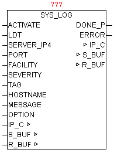

<!--
  Copyright (c) 2026 Hans Mühlbauer, Franz Höpfinger and others.

  This program and the accompanying materials are made available under the
  terms of the Eclipse Public License 2.0 which is available at
  https://www.eclipse.org/legal/epl-2.0

  SPDX-License-Identifier: EPL-2.0
-->

## SYS_LOG

| | |
|:---|:---|
| **Type	Funktionsbaustein** |  |
| **IN_OUT	IP_C** | IP_C (Parametrierungsdaten) |
| **S_BUF** | NETWORK_BUFFER (Sendedaten) |
| **R_BUF** | NETWORK_BUFFER (Empfangsdaten) |
| **INPUT	ACTIVATE** | BOOL (positive Flanke startet die Abfrage) |
| **LDT** | DT (Lokalzeit) |
| **SERVER_IP4** | DWORD  (IP-Adresse des SYS-LOG Servers) |
| **PORT** | WORD  (Port-Nummer des SYS-LOG Servers) |
| **FACILITY** | BYTE  (spezifiziert den Dienst oder die Komponente) |
| **SEVERITY** | BYTE  (Klassifizierung des Schweregrades) |
| **TAG** | STRING(32)  (Prozessname , ID etc. ) |
| **HOSTNAME** | STRING  (Name oder IP-Adresse des Senders) |
| **MESSAGE** | STRING(STRING_LENGTH)  (Nachrichtentext) |
| **OPTION** | BYTE  (diverse  ) |
| **OUTPUT	DONE** | BOOL  (Abfrage ohne Fehler beendet) |
| **ERROR** | DWORD  (Fehlercode) |
| | SYSLOG ist ein Standard zur Übermittlung von Meldungen in einem IP-Rechner-Netzwerk. Das Protokoll ist dabei sehr einfach aufgebaut – der Client sendet eine kurze Textnachricht an den SYSLOG-Empfänger. Der Empfänger wird auch als "syslog daemon" oder "syslog server" bezeichnet. Die Meldungen werden mittels UDP-Port 514 oder über TCP-Port 1468 gesendet und enthalten die Nachricht im Klartext. SYSLOG wird typischerweise für Computersystem-Management und Sicherheits-Überwachung benutzt. Damit ermöglicht es die leichte Integration von verschiedensten LOG-Quellen auf einen zentralen SYSLOG-Server. Die Server-Software gibt es für alle Plattformen mitunter auch als Free / Shareware. Unix bzw. Linux-Systeme haben einen SYSLOG-SERVER schon integriert. Durch eine positive Flanke von ACTIVATE wird aus den Parametern LDT, FACILITY, SEVERITY, TAG, HOSTNAME,MESSAGE eine SYSLOG-Nachricht generiert und an die  SERVER_IP4 Adresse gesendet. Mittels OPTION können noch diverse Eigenschaften gesteuert werden (Siehe Tabelle OPTION). Nach erfolgreichen Versenden wird DONE=TRUE, ansonsten wird bei ERROR die konkrete Fehlermeldung ausgegeben (Siehe ERROR von Baustein IP_CONTROL). |
| | FACILITY,SEVERITY,TIMESTAMP,HOSTNAME,TAG,MESSAGE |

**Beispiel:**

Beispiel:

MAIL.ERR: Sep 10 08:31:10 149.100.100.02 PLANT2_PLC1 This is a test message generated by OSCAT SYSLOG

Folgende OPTION können verwendet werden

Folgende Severity sind als Standard definiert:

Folgende Facility sind als Standard definiert:

Für allgemeine syslog-Nachrichten sind die Facility-Werte 16-23 vorgesehen (local0 bis local7). Es ist aber durchaus zulässig, auch die vordefinierten Werte 0 bis 15 für eigene Zwecke zu verwenden.

Mit Hilfe von Facility und Severity kann später auf den SYSLOG-Server (Datenbank)  sehr leicht nach bestimmten Meldungen gefiltert werden, wie beispielsweise: "Erfasse alle Mailserver-Nachrichten vom Schweregrad error".

Beispiel (Screenshot) eines SYSLOG-Servers für Windows

| BIT | Funktion |
| --- | --- |
| 0 | FALSE = mit Facility,Severity-CodeTRUE = ohne Facility,Severity-Code |
| 1 | FALSE = mit RFC HeaderTRUE = ohne RFC Header (nur die MESSAGE alleine wird versendet) |
| 2 | FALSE = mit CR,LF am EndeTRUE = ohne CR,LF am Ende |
| 3 | FALSE = UDP ModusTRUE = TCP Modus |

| Severity | Beschreibung |
| --- | --- |
| 0 | Emergency |
| 1 | Alert |
| 2 | Critical |
| 3 | Error |
| 4 | Warning |
| 5 | Notice |
| 6 | Informational |
| 7 | Debug |

| Facility | Beschreibung |
| --- | --- |
| 00 | Kernel message |
| 01 | user-level messages |
| 02 | mail system |
| 03 | system daemons |
| 04 | security/authorization messages |
| 05 | messages generated internally by syslogd |
| 06 | line printer subsystem |
| 07 | network news subsystem |
| 08 | UUCP subsystem |
| 09 | clock daemon |
| 10 | security/authorization messages |
| 11 | FTP daemon |
| 12 | NTP subsystem |
| 13 | log audit |
| 14 | log alert |
| 15 | clock daemon |
| 16 | local10 |
| 17 | local11 |
| 18 | local12 |
| 19 | local13 |
| 20 | local14 |
| 21 | local15 |
| 22 | local16 |
| 23 | local17 |
