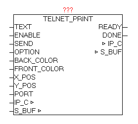
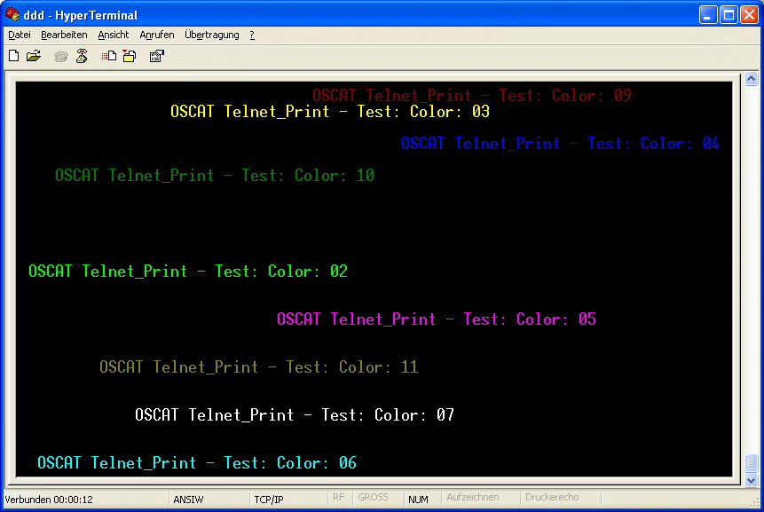

<!--
  Copyright (c) 2026 Hans Mühlbauer, Franz Höpfinger and others.

  This program and the accompanying materials are made available under the
  terms of the Eclipse Public License 2.0 which is available at
  https://www.eclipse.org/legal/epl-2.0

  SPDX-License-Identifier: EPL-2.0
-->

## TELNET_PRINT

| | |
|:---|:---|
| **Type	Funktionsbaustein** |  |
| **IN_OUT	IP_C** | IP_C (Parametrierungsdaten) |
| **S_BUF** | NETWORK_BUFFER (Sendedaten) |
| **INPUT	TEXT** | STRING(STRING_LENGTH) (Ausgabe Text) |
| **S_BUF_SIZE** | UINT ((Größe des S_BUF-Puffers) |
| **ENABLE** | BOOL (Freigabe Kommunikation) |
| **SEND** | BOOL (positive Flanke - Sendeanstoß) |
| **OPTION** | BYTE (Sende-Optionen) |
| **BACK_COLOR** | BYTE (Hintergrundfarbe) |
| **FRONT_COLOR** | BYTE (Vordergrundfarbe) |
| **X_POS** | BYTE (X-Koordinate der Schreibposition) |
| **Y_POS** | BYTE (Y-Koordinate der Schreibposition) |
| **PORT** | WORD (Port-Nummer) |
| **OUTPUT** | READY: BOOL (Baustein bereit) |
| **DONE** | BOOL (positive Flanke - Senden beendet) |
| | Der Baustein ermöglicht die einfache Ausgabe von Texten an eine TELNET-Konsole. Beim Parameter TEXT wird der gewünschte String übergeben. Um den Baustein für die Kommunikation freizuschalten muss ENABLE=1 gesetzt werden, damit erfolgt die Anmeldung beim IP_CONTROL. Bei  Parameter PORT wird die gewünschte Port-Nummer vorgegeben, wird der Parameter nicht beschalten , wo wird der Standard-Telnet-Port 23 verwendet. Mittels BACK_COLOR und FRONT_COLOR können die gewünschten Farben vorgegeben werden, vorausgesetzt die Funktion ist Parameter OPTION aktiviert. Die Parameter X_POS und Y_POS geben die gewünschte Koordinate der TEXT Ausgabe an. Wird bei X_POS und Y_POS der WERT „0“ angegeben, so ist die Textpositionierung inaktiv, und die Texte werden immer an der aktuellen Schreib-Cursor Position angehängt. Die Standard Telnet-Konsole erlaubt eine X_POS (Horizontal) von 1 bis 80 und eine  Y_POS (Vertikal) von 1 bis 25. Das Verhalten hier kann wiederum mittels OPTION beeinflusst werden (Autowrap, Carriage-Return, Line-Feed, Buf_Flush etc..). Wenn eine große Menge an Texten auf einmal ausgegeben werden muss, so kann eine Bufferung aktiviert werden, sodass die Daten erst geschrieben werden wenn entweder der Buffer voll ist (dies wird vom Baustein selbstständig veranlasst), oder dies durch den geänderten OPTION Parameter signalisiert wird. Durch SEND=1 werden die Daten in den Buffer geschrieben. Die Parameter dürfen erst wieder verändert werden wenn READY=1 ist, und mittels DONE wird die erfolgte Datenübernahme als positive Flanke angezeigt. |
| **OPTION** |  |
| **FRONT_COLOR** |  |
| **BACK_COLOR** |  |

| BIT | Funktion | Beschreibung |
| --- | --- | --- |
| 0 | SCREEN_INIT | Nach dem Verbindungsaufbau mit der TELNET-Konsole wird der gesamte Bildschirm gelöscht.  Wenn die OPTION COLOR aktiviert ist, wird der Bildschirm mit BACK_COLOR gelöscht. |
| 1 | AUTOWRAP | Bei AUTOWRAP=1 wird der Schreib-Cursor bei erreichen des Zeilenendes automatisch auf eine nächste Zeile gesetzt. Wenn bei der Textausgabe die X,Y Positionen immer mit angegeben werden , ist es besser wenn AUTOWRAP=0 ist. |
| 2 | COLOR | Aktiviert die den Farbe-Modus , dabei werden BACK_COLOR und FRONT_COLOR bei der Ausgabe angewandt. |
| 3 | NEW_LINE | Bei NEW_LINE=1 wird automatisch am Ende des Textes ein Carriage Return und Line-Feed angehängt. So dass die nächste Textausgabe in einer neuen Zeile beginnt. Dies ist aber nur dann Sinnvoll, wenn keine X_POS und Y_POS vorgegeben werden. |
| 4 | RESERVE |  |
| 5 | RESERVE |  |
| 6 | RESERVE |  |
| 7 | NO_BUF_FLUSH | Verhindert das die Daten im Buffer sofort gesendet werden. Nur wenn der Buffer komplett gefüllt ist, oder diese Option deaktiviert ist, werden die Daten versendet. Ermöglicht das  schnelle Senden von vielen Texten im selben Zyklus |

| Byte | Farbe | Byte | Farbe |
| --- | --- | --- | --- |
| 0 | Black | 16 | Flashing Black |
| 1 | Light Red | 17 | Flashing Light Red |
| 2 | Light Green | 18 | Flashing Light Green |
| 3 | Yellow | 19 | Flashing Yellow |
| 4 | Light Blue | 20 | Flashing Light Blue |
| 5 | Pink / Light Magenta | 21 | Flashing Pink / Light Magenta |
| 6 | Light Cyan | 22 | Flashing Light Cyan |
| 7 | White | 23 | Flashing White |
| 8 | Black | 24 | Flashing Black |
| 9 | Red | 25 | Flashing Red |
| 10 | Green | 26 | Flashing Green |
| 11 | Brown | 27 | Flashing Brown |
| 12 | Blue | 28 | Flashing Blue |
| 13 | Purple / Magenta | 29 | Purple / Magenta |
| 14 | Cyan | 30 | Flashing Cyan |
| 15 | Gray | 31 | Flashing Gray |

| Byte | Farbe |
| --- | --- |
| 0 | Black |
| 1 | Red |
| 2 | Green |
| 3 | Brown |
| 4 | Blue |
| 5 | Purple / Magenta |
| 6 | Cyan |
| 7 | Gray |
