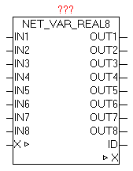

<!--
  Copyright (c) 2026 Hans Mühlbauer, Franz Höpfinger and others.

  This program and the accompanying materials are made available under the
  terms of the Eclipse Public License 2.0 which is available at
  https://www.eclipse.org/legal/epl-2.0

  SPDX-License-Identifier: EPL-2.0
-->

## NET_VAR_REAL8

| | |
|:---|:---|
| **Type	Funktionsbaustein** |  |
| **IN_OUT	X** | NET_VAR_DATA (NET_VAR Datenstruktur) |
| **INPUT	IN1..8** | REAL (Eingangwert) |
| **OUTPUT	OUT1..8** | REAL (Ausgangswert) |
| **ID** | BYTE (Identifikationsnummer) |
| | Der Baustein NET_VAR_REAL8 dient zum bidirektionalen Übertragen von acht REAL-Werten vom Master zum Slave und umgekehrt. Die REAL-Werte IN1..8 werden erfasst und an der anderen Seite (Steuerung) am gleichen Baustein an der gleichen Position als OUT1..8 wieder ausgegeben. |
| | Gleichzeitig werden die an der Gegenseite (andere Steuerung) übergebenen Eingangs-REAL-Werte hier als OUT1..8 wieder ausgegeben. |
| | Parameter ID zeigt die aktuelle Identifikationsnummer der Bausteininstanz. Ist die Konfiguration des Master und des Slave Programmes unterschiedlich (fehlerhaft) wird diese ID-Nummer als Fehlerort beim Baustein NET_VAR_CONTROL ausgegeben. |

