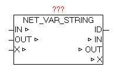

<!--
  Copyright (c) 2026 Hans Mühlbauer, Franz Höpfinger and others.

  This program and the accompanying materials are made available under the
  terms of the Eclipse Public License 2.0 which is available at
  https://www.eclipse.org/legal/epl-2.0

  SPDX-License-Identifier: EPL-2.0
-->

## NET_VAR_STRING

| | |
|:---|:---|
| **Type	Funktionsbaustein** |  |
| **IN_OUT	X** | NET_VAR_DATA (NET_VAR Datenstruktur) |
| **IN** | STRING(STRING_LENGTH) (Eingangs-String) |
| **OUT** | STRING(STRING_LENGTH) (Ausgangs-String) |
| **OUTPUT		ID** | BYTE (Identifikationsnummer) |
| | Der Baustein NET_VAR_STRING dient zum bidirektionalen Übertragen von einem STRING vom Master zum Slave und umgekehrt. Der STRING bei Parameter IN wird erfasst und an der anderen Seite (Steuerung) am gleichen Baustein an der gleichen Position als OUT Parameter wieder ausgegeben. |
| | Gleichzeitig wird der an der Gegenseite (andere Steuerung) übergebenen Eingangs-STRING-Wert hier als OUT wieder ausgegeben. |
| | Parameter ID zeigt die aktuelle Identifikationsnummer der Bausteininstanz. Ist die Konfiguration des Master und des Slave Programmes unterschiedlich (fehlerhaft) wird diese ID-Nummer als Fehlerort beim Baustein NET_VAR_CONTROL ausgegeben. |

