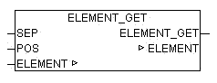

<!--
  Copyright (c) 2026 Hans Mühlbauer, Franz Höpfinger and others.

  This program and the accompanying materials are made available under the
  terms of the Eclipse Public License 2.0 which is available at
  https://www.eclipse.org/legal/epl-2.0

  SPDX-License-Identifier: EPL-2.0
-->

## ELEMENT_GET

| | |
|:---|:---|
| **Type	Funktion** | STRING(ELEMENT_LENGTH) |
| **Input	SEP** | BYTE (Separationszeichen der Elemente) |
| **POS** | INT (Position des Elements) |
| **I/O	ELEMENT** | STRING(ELEMENT_LENGTH) (Eingangsliste) |
| **Output** | STRING (Ausgangsstring) |
| | ELEMENT_GET lieferte das Element an der Stelle POS aus einer Elementeinliste. Die Liste besteht aus Zeichenketten die mit dem Separationszeichen SEP getrennt sind. Das erste Element der Liste hat die Position 0. |

**Beispiel:**

Beispiele:

ELEMENT_GET('ABC,23,,NEXT', 44, 0) = 'ABC'

ELEMENT_GET('ABC,23,,NEXT', 44, 1) = '23'

ELEMENT_GET('ABC,23,,NEXT', 44, 2) = ''

ELEMENT_GET('ABC,23,,NEXT', 44, 3) = 'NEXT'

ELEMENT_GET('ABC,23,,NEXT', 44, 4) = ''

ELEMENT_GET('', 44, 0) = ''
