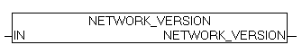

<!--
  Copyright (c) 2026 Hans Mühlbauer, Franz Höpfinger and others.

  This program and the accompanying materials are made available under the
  terms of the Eclipse Public License 2.0 which is available at
  https://www.eclipse.org/legal/epl-2.0

  SPDX-License-Identifier: EPL-2.0
-->

## NETWORK_VERSION

| | |
|:---|:---|
| **Type	Funktion** | DWORD |
| **Input	IN** | BOOL (wenn TRUE liefert der Baustein das Release Datum) |
| **Output** | (Version der Bibliothek) |
| | NETWORK_VERSION gibt wenn IN = FALSE die aktuelle Versionsnummer als DWORD zurück. Wird IN auf TRUE gesetzt so wird das Release Datum der aktuellen Version als DWORD zurückgegeben. |

**Beispiel:**

Beispiel: 	NETWORK_VERSION(FALSE) = 111 für Version 1.11

DWORD_TO_DATE(NETWORK_VERSION(TRUE)) = 2011-2-3
