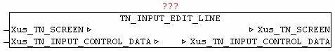

<!--
  Copyright (c) 2026 Hans Mühlbauer, Franz Höpfinger and others.

  This program and the accompanying materials are made available under the
  terms of the Eclipse Public License 2.0 which is available at
  https://www.eclipse.org/legal/epl-2.0

  SPDX-License-Identifier: EPL-2.0
-->

## TN_INPUT_EDIT_LINE

| | | |
|:---|:---|:---|
| **Type** | Funktionsbaustein | |
| **IN_OUT	Xus_TN_SCREEN** | us_TN_SCREEN | |
| **Xus_TN_INPUT_CONTROL** | us_TN_INPUT_CONTROL | |
| | Der Baustein TN_INPUT_EDIT_LINE dient zum verwalten einer Eingabezeile. Dazu muss *.in_Type = 1 gesetzt werden. | |
| | Das Element wird an *.in_X und *.in_Y dargestellt.Jede Eingabezeile kann auch mit einem Titletext versehen werden. Mit *.in_Title_X_Offset und *.in_Title_Y_Offset wird die Position relativ zu den Element-Koordinaten angegeben. Die Farbe kann mit *.by_Title_Attr bestimmt werden, sowie der Text durch *.st_Title_String. Soll ein ToolTip zum Element angezeigt werden so muss bei *.st_Input_ToolTip der Text angegeben werden. | |
| | Besitzt das Element den Fokus , kann mittels der Tasten Cursor Links/Rechts innerhalb der Zeile der Blink-Cursor verschoben werden. Mit der Backspace Taste können eingegebene Zeichen wieder gelöscht werden. Durch Betätigen der Eingabe/Return Taste wird der Eingabetext bei *.st_Input_String ausgegeben und *.bo_Input_Entered = TRUE. Das Eingabe-Flag muss nach Entgegennahme vom Anwender rückgesetzt werden. Mittels *.bo_Input_Hidden = TRUE wird die verdeckte Eingabe aktiviert, dadurch werden alle eingegebenen Zeichen mit '*' dargestellt. | |
| | Mittels *.st_Input_Mask wird bestimmt an welcher Position und wie viele Zeichen eingegeben werden können. An jeder Position an der sich ein Leerzeichen befindet können eingaben gemacht werden. Bei der Initialisierung muss einmalig *.st_Input_Mask nach *.st_Input_Data kopiert werden. | |
| | Ist *.bo_Input_Only_Num = TRUE werden nur nummerische Tasten akzeptiert  und übernommen. | |
| ***.in_Type** | = INT#01; *.in_Y := INT#16; *.in_X := INT#09; *.by_Attr_mF := BYTE#16#72; (* Weiss, Grün *) *.by_Attr_oF := BYTE#16#74; (* Weiss, Blau *) *.in_Cursor_Pos := INT#0; *.bo_Input_Only_Num := FALSE; *.bo_Input_Hidden := FALSE; *.st_Input_Mask := '  '; *.st_Input_Data :=  *.st_Input_Mask; *.st_Input_ToolTip := 'Eingabezeile aktiv  | SCROLL F1/F2/F3/F4 |'; *.in_Input_Option := INT#02; *.in_Title_Y_Offset := INT#00; *.in_Title_X_Offset := INT#00; *.by_Title_Attr := BYTE#16#34; *.st_Title_String := 'Befehl: '; |

**Beispiel:**

Beispiel:

Ergibt folgende Ausgabe:
