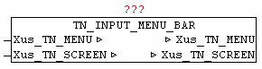
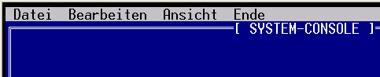
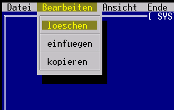

<!--
  Copyright (c) 2026 Hans Mühlbauer, Franz Höpfinger and others.

  This program and the accompanying materials are made available under the
  terms of the Eclipse Public License 2.0 which is available at
  https://www.eclipse.org/legal/epl-2.0

  SPDX-License-Identifier: EPL-2.0
-->

## TN_INPUT_MENU_BAR

| | |
|:---|:---|
| **Type** | Funktionsbaustein |
| **IN_OUT	Xus_TN_SCREEN** | us_TN_SCREEN |
| **Xus_TN_MENU** | us_TN_MENU |
| | Der Baustein TN_INPUT_MENU_BAR dient zum verwalten und anzeigen der Menu_Bar. Das Element wird an *.in_X und *.in_Y dargestellt. Die Menu-Elemente sind als verschachelte Elemente innerhalb *.st_MENU_TEXT hinterlegt. Dabei werden zwei verschiedene Trennzeichen verwendet. Ein '$' trennt die verschiedenen Menu-Listen, und jede Menu-Liste wird wiederum mittels '#' in einzelne Menu-Elemente unterteilt. Die erste Menu-Liste stellt die eigentliche Menu-Bar dar, das heißt daraus ergibt sich die Anzahl der Sub-Menu bzw. die Überschriften der Elemente. Danach folgen alle Sub-Menu-Listen immer getrennt mit '%'. Um einzelne Sub-Menu Elemente voneinader abzugrenzen bzw. mit einer Trennlinie zu versehen, muss als Text des Menu-Elementes ein '-' angegeben werden. |
| **Durch betätigen er Escape-Taste wird die Menu-Bar aktiviert und das jeweilige Sub-Menu wird mit Hilfe des Bausteins TN_INPUT_MENU_POPUP dargestellt. Innerhalb des Sub-Menu kann mit Cursor oben/unten navigiert werden. Wird Cursor Links/Rechts betätigt so wird automatisch zum nächsten Haupt-Menu gewechselt und das zugehörige Sub-Menu angezeigt. Wird ein Sub-Menu-Element mit Enter/Return Taste bestätigt, so wird bei *.in_Menu_Selected die Nummer des gewählten Menu-Punktes ausgegeben. Die Berechnung der Menu-Punktnummer erfolgt folgend** | Hauptmenu-Index * 10 + Submenu-Index. Der Eintrag in *.in_Menu_Selected muss vom Anwender nach Entgegennahme wieder auf 0 gesetzt werden. |
| | Somit sind maximal 9 Hauptmenu-Items und je 9 Submenu-Items ausführbar. Mittels Escape-Taste kann jederzeit das Menu wieder ausgeblendet werden. |
| | Ein aktives Menu sichert automatisch den Hintergrund bevor es gezeichnet wird, und restauriert den Hintergrund wieder nach Beendigung. |
| | Solange eine Menu-Anzeige aktiv ist, dürfen vom Anwenderprogramm aber keinerlei grafisches Veränderungen gemacht werden. Dies kann mittels TN_SCREEN.bo_Menue_Bar_Dialog = TRUE überprüft werden. |
| ***.in_X** | = INT#00; |
| ***.in_Y** | = INT#00; |
| ***.by_Attr_mF** | = BYTE#16#33; (* yellow + brown *) |
| ***.by_Attr_oF** | = BYTE#16#0F; (* schwarz + grau *) |
| ***.st_MENU_TEXT** | = 'Datei#Bearbeiten#Ansicht#Ende'; |
| ***.st_MENU_TEXT** | = CONCAT(*.st_MENU_TEXT, |
| ***.st_MENU_TEXT** | = CONCAT(*.st_MENU_TEXT, |
| ***.bo_Create** | = TRUE; |

**Beispiel:**

Beispiel:

'%oeffnen#-#speichern#beenden%loeschen#-#einfuegen#-#kopieren');

'%alles#detail#kopieren%Logout');

Ergibt folgende Ausgabe:
