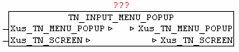

<!--
  Copyright (c) 2026 Hans Mühlbauer, Franz Höpfinger and others.

  This program and the accompanying materials are made available under the
  terms of the Eclipse Public License 2.0 which is available at
  https://www.eclipse.org/legal/epl-2.0

  SPDX-License-Identifier: EPL-2.0
-->

## TN_INPUT_MENU_POPUP

| | |
|:---|:---|
| **Type** | Funktionsbaustein |
| **IN_OUT	Xus_TN_SCREEN** | us_TN_SCREEN |
| **Xus_TN_MENU** | us_TN_MENU |
| | Der Baustein TN_INPUT_MENU_POPUP dient zum verwalten und anzeigen der Menu_Bar Submenu und für der Darstellung von TN_INPUT_SELECT_POPUP Elementen. Das Element wird an *.in_X und *.in_Y dargestellt. Die Menu-Elemente sind als Elemente innerhalb *.st_Menu_Text hinterlegt. Dabei werden die einzelnen Element mittels '#' voneinander getrennt. Um einzelne Sub-Menu Elemente voneinander abzugrenzen bzw. mit einer Trennlinie zu versehen, muss als Text des Menu-Elementes ein '-' angegeben werden. |
| | Innerhalb des Sub-Menu kann mit Cursor oben/unten navigiert werden.  Wird ein Sub-Menu-Element mit Enter/Return Taste bestätigt, so wird bei *.in_Menu_Selected die Nummer des gewählten Menu-Punktes ausgegeben. |
| | Ein aktives Menu-Popup sichert automatisch den Hintergrund bevor es gezeichnet wird, und restauriert den Hintergrund wieder nach Beendigung. |
| | Solange eine Menu-Anzeige aktiv ist, dürfen vom Anwenderprogramm aber keinerlei grafisches Veränderungen gemacht werden. Dies kann mittels TN_SCREEN.bo_Menue_Bar_Dialog = TRUE bzw. TN_SCREEN.bo_Modal_Dialog = TRUE überprüft werden. |
| | Der Baustein wird primär vom TN_INPUT_MENU_BAR und TN_INPUT_SELECT_POPUP intern benutzt, und muss nicht direkt vom Anwender ausgeführt werden. |

