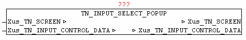

<!--
  Copyright (c) 2026 Hans Mühlbauer, Franz Höpfinger and others.

  This program and the accompanying materials are made available under the
  terms of the Eclipse Public License 2.0 which is available at
  https://www.eclipse.org/legal/epl-2.0

  SPDX-License-Identifier: EPL-2.0
-->

## TN_INPUT_SELECT_POPUP

| | | |
|:---|:---|:---|
| **Type** | Funktionsbaustein | |
| **IN_OUT	Xus_TN_SCREEN** | us_TN_SCREEN | |
| **Xus_TN_INPUT_CONTROL** | us_TN_INPUT_CONTROL | |
| | Der Baustein TN_INPUT_SELECT_POPUP dient zum verwalten einer Auswahl von Texten, durch anzeige eines Popup-Dialogs. Dazu muss *.in_Type = 3 gesetzt werden. | |
| | Das Element wird an *.in_X und *.in_Y dargestellt.Jede Eingabezeile kann auch mit einem Titletext versehen werden. Mit *.in_Title_X_Offset und *.in_Title_Y_Offset wird die Position relativ zu den Element-Koordinaten angegeben. Die Farbe kann mit *.by_Title_Attr bestimmt werden, sowie der Text durch *.st_Title_String. Soll ein ToolTip zum Element angezeigt werden so muss bei *.st_Input_ToolTip der Text angegeben werden. | |
| | Die Auswahltexte werden über *.st_Input_Data übergeben. Die Text-Element müssen durch das Zeichen '#' von einander getrennt werden. | |
| | Besitzt das Element den Fokus , kann mittels der Enter/Return Taste der Auswahl-Dialog aktiviert werden. | |
| | Mittels Cursor Hoch/Runter kann zwischen den einzelnem Elementen gewechselt werden. Wird der Anfang bzw. das Ende der Liste erreicht so wird an der gegenüberliegenden Seite fortgesetzt | |
| | Die Text-Element wird dabei mittels *.st_Input_Mask verknüpft, das heißt damit kann die Ausgabe-Textlänge nachträglich beeinflusst werden. | |
| | Durch Betätigen der Eingabe/Return Taste wird der Text des gewählten Elementes bei *.st_Input_String ausgegeben und *.bo_Input_Entered = TRUE. Das Eingabe-Flag muss nach Entgegennahme vom Anwender rückgesetzt werden. | |
| | Eine aktive Auswahl (Auswahl-Dialog) kann jederzeit mit der Escape-Taste abgebrochen werden. | |
| ***.in_Type** | = 03; *.in_Y := 20; *.in_X := 18; *.by_Attr_mF := 16#17; *.by_Attr_oF := 16#47; *.st_Input_ToolTip := | ' aktuellen LOG-Level aendern  | press enter to select |'; *.in_Input_Option := 00; *.in_Title_Y_Offset := 00; *.in_Title_X_Offset := 00; *.by_Title_Attr := 16#34; *.st_Title_String := ' LOG-Level '; *.st_Input_Mask := '  '; *.st_Input_Data := 	'01#02#03#04#05#06#07#08#09#10#11#12#13#14#15'; |

**Beispiel:**

Beispiel:

Ergibt folgende Ausgabe:
