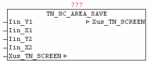

<!--
  Copyright (c) 2026 Hans Mühlbauer, Franz Höpfinger and others.

  This program and the accompanying materials are made available under the
  terms of the Eclipse Public License 2.0 which is available at
  https://www.eclipse.org/legal/epl-2.0

  SPDX-License-Identifier: EPL-2.0
-->

## TN_SC_AREA_SAVE

| | |
|:---|:---|
| **Type** | Funktionsbaustein |
| **INPUT** | Iin_Y1 : INT : (Y1-Koordinate der Fläche) |
| **Iin_X1** | INT : (X1-Koordinate der Fläche) |
| **Iin_Y2** | INT : (Y2-Koordinate der Fläche) |
| **Iin_X2** | INT : (X2-Koordinate der Fläche) |
| **IN_OUT	Xus_TN_SCREEN** | us_TN_SCREEN |
| | Der Baustein TN_SC_AREA_SAVE ermöglicht das sichern von rechteckigen Flächen des Bildschirms bevor dieser durch anderen Zeichenoperationen verändert wird. Dies wird vorwiegend vor dem Aufruf vom Baustein MENU-BAR und MENU-POPUP  gemacht , da diese die Elemente als Overlay-Grafik darstellen. Mittels X1,Y1 und X2,Y2 werden die Koordinaten des zu sichernden Bildschirmbereichs angegeben. Dabei werden die Daten in den Datenbereich Xus_TN_SCREEN.bya_BACKUP[x] gesichert. Es werden hierbei die Koordinaten und die eigentlichen Zeichen und Farbinformationen darin abgelegt. Der Buffer kann maximal die halbe Fläche des Bildschirms aufnehmen. |

