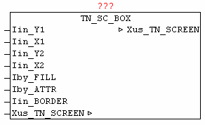

<!--
  Copyright (c) 2026 Hans Mühlbauer, Franz Höpfinger and others.

  This program and the accompanying materials are made available under the
  terms of the Eclipse Public License 2.0 which is available at
  https://www.eclipse.org/legal/epl-2.0

  SPDX-License-Identifier: EPL-2.0
-->

## TN_SC_BOX

| | |
|:---|:---|
| **Type** | Funktionsbaustein |
| **INPUT** | Iin_Y1 : INT : (Y1-Koordinate der Fläche) |
| **Iin_X1** | INT : (X1-Koordinate der Fläche) |
| **Iin_Y2** | INT : (Y2-Koordinate der Fläche) |
| **Iin_X2** | INT : (X2-Koordinate der Fläche) |
| **Iby_FILL** | BYTE : (Charakter zum füllen der Fläche) |
| **Iby_ATTR** | BYTE : (Farbcode zum füllen der Fläche) |
| **Iby_BORDER** | BYTE : (Typ der Umrahmung) |
| **IN_OUT	Xus_TN_SCREEN** | us_TN_SCREEN |
| | Der Baustein TN_SC_BOX dient zum zeichnen eines rechteckigen Bereiches,der mit dem bei Iby_FILL angegebenen Charakter gefüllt wird. Mit Parameter Iby_ATTR kann die Füllfarbe vorgegeben werden. Der Füllbereich wird mit einer Umrandung gezeichnet, die mittels Iin_BORDER vorgegeben wird. |
| **Border-Typen** |  |
| | 0 = kein Rahmen |
| | 1 = Rahmen mit Einzellinie |
| | 2 = Rahmen mit Doppelllinie |
| | 3 = Rahmen mit Leerzeichen |

**Beispiel:**

Beispiel: Box mit Füllzeichen 'X' und Farbe Weiß auf Blau

Darstellung mit Iin_BORDER Wert 0,1,2 und 3 (von Links nach Rechts)
