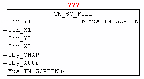

<!--
  Copyright (c) 2026 Hans Mühlbauer, Franz Höpfinger and others.

  This program and the accompanying materials are made available under the
  terms of the Eclipse Public License 2.0 which is available at
  https://www.eclipse.org/legal/epl-2.0

  SPDX-License-Identifier: EPL-2.0
-->

## TN_SC_FILL

| | |
|:---|:---|
| **Type** | Funktionsbaustein |
| **INPUT** | Iin_Y1 : INT : (Y1-Koordinate der Fläche) |
| **Iin_X1** | INT : (X1-Koordinate der Fläche) |
| **Iin_Y2** | INT : (Y2-Koordinate der Fläche) |
| **Iin_X2** | INT : (X2-Koordinate der Fläche) |
| **Iby_CHAR** | BYTE : (Charakter zum füllen der Fläche) |
| **Iby_ATTR** | BYTE : (Farbcode zum füllen der Fläche) |
| **IN_OUT	Xus_TN_SCREEN** | us_TN_SCREEN |
| | Der Baustein TN_SC_FILL dient zum zeichnen eines rechteckigen Bereiches, der mit dem bei Iby_FILL angegebenen Charakter gefüllt wird. |

**Beispiel:**

Beispiel: Box mit Füllzeichen 'X' und Farbe Weiß auf Blau
