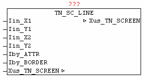
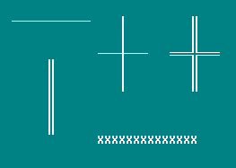

<!--
  Copyright (c) 2026 Hans Mühlbauer, Franz Höpfinger and others.

  This program and the accompanying materials are made available under the
  terms of the Eclipse Public License 2.0 which is available at
  https://www.eclipse.org/legal/epl-2.0

  SPDX-License-Identifier: EPL-2.0
-->

## TN_SC_LINE

| | |
|:---|:---|
| **Type** | Funktionsbaustein |
| **INPUT** | Iin_Y1 : INT : (Y1-Koordinate der Linie) |
| **Iin_X1** | INT : (X1-Koordinate der Linie) |
| **Iin_Y2** | INT : (Y2-Koordinate der Linie) |
| **Iin_X2** | INT : (X2-Koordinate der Linie) |
| **Iby_ATTR** | BYTE : (Farbcode der Linie) |
| **Iby_BORDER** | BYTE : (Typ der Linie) |
| **IN_OUT	Xus_TN_SCREEN** | us_TN_SCREEN |
| | Der Baustein TN_SC_LINE dient zum zeichnen von waagrechten und senkrechten Linien. Mittels der X1/Y1 und X2/Y2 Koordinaten wird der Beginn und das Ende der Linie definiert. Die Linien-Type wird mittels Iin_BORDER und der Farbcode mit Iby_ATTR übergeben. Wird beim Linien zeichnen eine andere Linie dieser Type geschnitten, so wird automatisch das passende Kreuzungszeichen benutzt. |
| **Border-Typen** |  |
| | 1 = Linie mit Einzellinie |
| | 2 = Linie mit Doppelllinie |
| | >2 = Linie wird mit dem bei Iin_BORDER angegebenen Charakter gezeichnet |

**Beispiel:**

Beispiel:

Horizontale Linie: Typ Single-Line

Vertikale Linie: Typ Double-Line

Horizontale und Vertikale Linie gekreuzt: Typ Single-Line

Horizontale und Vertikale Linie gekreuzt: Typ Double-Line

Horizontale Linie: Typ Charakter (X)
