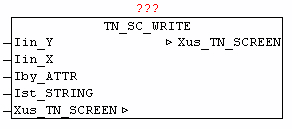

<!--
  Copyright (c) 2026 Hans Mühlbauer, Franz Höpfinger and others.

  This program and the accompanying materials are made available under the
  terms of the Eclipse Public License 2.0 which is available at
  https://www.eclipse.org/legal/epl-2.0

  SPDX-License-Identifier: EPL-2.0
-->

## TN_SC_WRITE

| | |
|:---|:---|
| **Type** | Funktionsbaustein |
| **INPUT	Iin_Y** | INT (Y-Koordinate) |
| **Iin_X** | INT (X-Koordinate) |
| **Iby_ATTR** | BYTE : (Farbcode - Schriftfarbe) |
| **Ist_STRING** | STRING (Text) |
| **IN_OUT	Xus_TN_SCREEN** | us_TN_SCREEN |
| | Der Baustein TN_SC_WRITE gibt an der angegebenen Koordinate  Iin_Y, Iin_Y den Text Ist_STRING mit der Farbe Iby_ATTR aus. |
| | Wird als Farbcode = 0 angegeben, dann wird der String ausgegeben, ohne das die vorhandenen alten Farbinformationen an den jeweiligen Zeichenpositionen verändert werden. |

