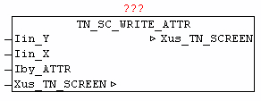

<!--
  Copyright (c) 2026 Hans Mühlbauer, Franz Höpfinger and others.

  This program and the accompanying materials are made available under the
  terms of the Eclipse Public License 2.0 which is available at
  https://www.eclipse.org/legal/epl-2.0

  SPDX-License-Identifier: EPL-2.0
-->

## TN_SC_WRITE_ATTR

| | |
|:---|:---|
| **Type** | Funktionsbaustein |
| **INPUT	Iin_Y** | INT (Y-Koordinate) |
| **Iin_X** | INT (X-Koordinate) |
| **Iby_ATTR** | BYTE : (Farbcode) |
| **IN_OUT	Xus_TN_SCREEN** | us_TN_SCREEN |
| | Der Baustein TN_SC_WRITE_ATTR ändert an der angegebenen Koordinate  Iin_Y, Iin_Y den Farbcode ohne das vorhandene Zeichen an der Position zu verändern. |

