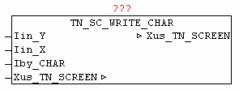

<!--
  Copyright (c) 2026 Hans Mühlbauer, Franz Höpfinger and others.

  This program and the accompanying materials are made available under the
  terms of the Eclipse Public License 2.0 which is available at
  https://www.eclipse.org/legal/epl-2.0

  SPDX-License-Identifier: EPL-2.0
-->

## TN_SC_WRITE_CHAR

| | |
|:---|:---|
| **Type** | Funktionsbaustein |
| **INPUT	Iin_Y** | INT : (Y-Koordinate) |
| **Iin_X** | INT : (X-Koordinate) |
| **OUTPUT	Iby_CHAR** | BYTE : (Zeichen) |
| **IN_OUT	Xus_TN_SCREEN** | us_TN_SCREEN |
| | Der Baustein TN_SC_WRITE_CHAR gibt das Zeichen Iby_CHAR an der angegebenen Koordinate Iin_Y, Iin_X aus, und verändert dabei die Farbinformation an der angegebene Position nicht. |

