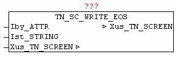

<!--
  Copyright (c) 2026 Hans Mühlbauer, Franz Höpfinger and others.

  This program and the accompanying materials are made available under the
  terms of the Eclipse Public License 2.0 which is available at
  https://www.eclipse.org/legal/epl-2.0

  SPDX-License-Identifier: EPL-2.0
-->

## TN_SC_WRITE_EOS

| | |
|:---|:---|
| **Type** | Funktionsbaustein |
| **INPUT	Iby_ATTR** | BYTE : (Farbcode - Schriftfarbe) |
| **Ist_STRING** | STRING (Text) |
| **IN_OUT	Xus_TN_SCREEN** | us_TN_SCREEN |
| | Der Baustein TN_SC_WRITE_EOS gibt an der Endposition des zuletzt mit  TN_SC_WRITE oder TN_SC_WRITE_EOS ausgegebenen Textes den Text Ist_STRING mit der Farbe Iby_ATTR aus. |
| | Damit können fortlaufend Texte ausgegeben werden, ohne das immer extra die neuen Koordinaten mit angegeben werden müssen. |

