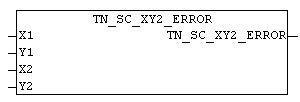

<!--
  Copyright (c) 2026 Hans Mühlbauer, Franz Höpfinger and others.

  This program and the accompanying materials are made available under the
  terms of the Eclipse Public License 2.0 which is available at
  https://www.eclipse.org/legal/epl-2.0

  SPDX-License-Identifier: EPL-2.0
-->

## TN_SC_XY2_ERROR

| | |
|:---|:---|
| **Type	Funktion** | BOOL |
| **INPUT** | X1 : INT : (X1-Koordinate der Fläche) |
| **Y1** | INT : (Y1-Koordinate der Fläche) |
| **X2** | INT : (X2-Koordinate der Fläche) |
| **Y2** | INT : (Y2-Koordinate der Fläche) |
| | Der Baustein TN_SC_XY2_ERROR prüft ob sich die angegeben Koordinaten  innerhalb des Bildschirmbereiches befindet. Die Fläche darf nicht über den Bildschirmrand hinaus gehen. Wenn die Überprüfung negativ ausfällt wird als Ergebnis TRUE ausgegeben. |

