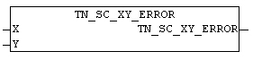

<!--
  Copyright (c) 2026 Hans Mühlbauer, Franz Höpfinger and others.

  This program and the accompanying materials are made available under the
  terms of the Eclipse Public License 2.0 which is available at
  https://www.eclipse.org/legal/epl-2.0

  SPDX-License-Identifier: EPL-2.0
-->

## TN_SC_XY_ERROR

| | |
|:---|:---|
| **Type	Funktion** | BOOL |
| **INPUT** | X : INT : (X-Koordinate) |
| **Y** | INT : (Y-Koordinate) |
| | Der Baustein TN_SC_XY_ERROR prüft ob sich die angegebene Koordinate  innerhalb des Bildschirmbereiches befindet. Wenn die Überprüfung negativ ausfällt wird als Ergebnis TRUE ausgegeben. |

