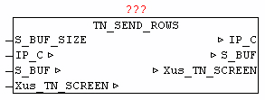

<!--
  Copyright (c) 2026 Hans Mühlbauer, Franz Höpfinger and others.

  This program and the accompanying materials are made available under the
  terms of the Eclipse Public License 2.0 which is available at
  https://www.eclipse.org/legal/epl-2.0

  SPDX-License-Identifier: EPL-2.0
-->

## TN_SEND_ROWS

| | |
|:---|:---|
| **Type** | Funktionsbaustein |
| **INPUT	S_BUF_SIZE** | UINT (Anzahl Bytes in S_BUF.BUFFER) |
| **IN_OUT	IP_C** | IP_CONTROL  (Verbindungsdaten) |
| **S_BUF** | NETWORK_BUFFER (Sendedaten) |
| **Xus_TN_SCREEN** | us_TN_SCREEN |
| | Der Baustein TN_SEND_ROWS dient zum automatischen Updaten der grafischen Änderungen am Telnet-Screen, indem die veränderten Zeilen an den Telnet-Client versendet werden. |
| | Wird am Telnet-Screen eine Farbe oder ein Zeichen in einer Zeile verändert, so wird immer automatisch diese Zeile zum Update markiert. Der Baustein überprüft ob bei Xus_TN_SCREEN.bya_Line_Update[0..23] eine oder mehrere Zeilen markiert sind, und erzeugt daraus eine ANSI-Code Byte-Stream der an den Telnet-Client gesendet wird. Weiters wird bei Xus_TN_SCREEN.bo_Clear_Screen = TRUE ein Clear-Screen ausgelöst. Bei erkennen einer neuen Telnet-Client Verbindung werden automatisch alle Zeilen zum Update markiert, damit der ganze Bildschirminhalt ausgegeben wird. Ist die erforderliche Datenmenge größer als S_BUF.BUFFER werden die Daten automatisch Blockweise ausgegeben. |

