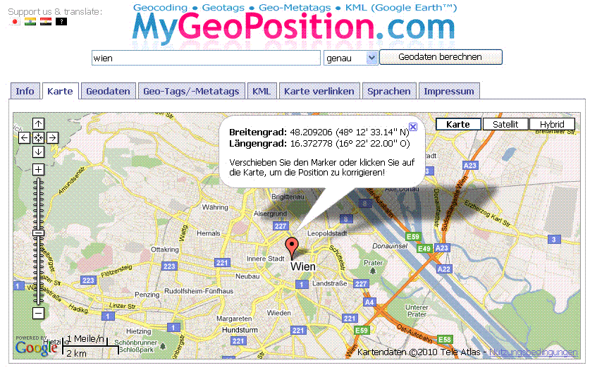

<!--
  Copyright (c) 2026 Hans Mühlbauer, Franz Höpfinger and others.

  This program and the accompanying materials are made available under the
  terms of the Eclipse Public License 2.0 which is available at
  https://www.eclipse.org/legal/epl-2.0

  SPDX-License-Identifier: EPL-2.0
-->

## WORLD_WEATHER

| | |
|:---|:---|
| **Type	Funktionsbaustein** |  |
| **IN_OUT	IP_C** | IP_C (Parametrierungsdaten) |
| **S_BUF** | NETWORK_BUFFER  (Sendedaten) |
| **R_BUF** | NETWORK_BUFFER  (Empfangsdaten) |
| **WW** | WORLD_WEATHER_DATA  (Wetterdaten) |
| **INPUT	ACTIVATE** | BOOL (positive Flanke startet die Abfrage) |
| **LATITUDE** | REAL (Breitengrad des Bezugsortes) |
| **LONGITUDE** | REAL (Längengrad des Bezugsortes) |
| **KEY** | STRING(30)  (API-Key) |
| **OUTPUT	BUSY** | BOOL  (Abfrage ist aktiv) |
| **DONE** | BOOL  (Abfrage ohne Fehler beendet) |
| **ERROR_C** | DWORD  (Fehlercode) |
| **ERROR_T** | BYTE  (Fehlertype) |
| **Der Baustein lädt die aktuellen Wetterdaten des angegebene Ortes von  http** | //worldweather.com herunter, analysiert die Daten und legt die wesentlichen Daten aufbereitet in der WORLD_WEATHER_DATA Datenstruktur ab. |
| | Vom aktuellen Tag werden folgende Werte abgelegt. |
| | Observation time (UTC) , Temperature (°C) , Unique Weather Code , Weather description text, Wind speed in miles per hour , Wind speed in kilometre per hour , Wind direction in degree , 16-Point wind direction compass ,Precipitation amount in millimetre , Humidity (%) , Visibility (km) ,Atmospheric pressure in milibars , Cloud cover (%) |
| | Vom aktuellen Tag und den darauffolgenden 4 Tagen werden folgende Werte abgelegt. |
| | Date for which the weather is forecasted , Day and night temperature in °C(Celcius) and °F(Fahrenheit) , Wind Speed in mph (miles per hour) and kmph (Kilometer per hour) , 16-Point compass wind direction , A unique weather condition code , Weather description text , Precipitation Amount (millimetre) |
| | Mit einer positiven Flanke von ACTIVATE wird die Abfrage gestartet und eine DNS Abfrage mit nachfolgender HTTP-GET durchgeführt. Nach erfolgreichen Empfang der Daten werden alle Elemente durchlaufen und wenn benötigt in der Datenstruktur in konvertierter Form abgelegt. Durch die Parameter LATITUDE und LONGITUDE wird der genaue Ort (Geografische Position) des Wetters angegeben. Während die Abfrage aktiv ist, wird BUSY=TRUE ausgegeben. Nach erfolgreich beendeter Abfrage wird DONE=TRUE ausgegeben. Sollte bei der Abfrage ein Fehler auftreten so wird dieser unter ERROR_C gemeldet in Kombination mit ERROR_T. |
| **ERROR_T** |  |
| **Neuen API-KEY anlegen** |  |
| **Mittels Internet-Browser die Seite http** | //www.worldweatheronline.com aufrufen und mittels Button „Free sign up“ den Registrierungsdialog aufrufen, und die erforderlichen Felder ausfüllen. Nach der Registrierung wird eine Email versendet, die wiederum bestätigt werden muss, und in weiterer Folge wird in einer zweiten Email der persönliche API-Key versendet. Dieser API-Key muss beim Baustein am Parameter API-KEY übergeben werden. |
| **Breiten und Längengrad eines bestimmten Ortes bestimmen** |  |
| **Mittels Internet-Browser die Seite http** | //www.mygeoposition.com/ aufrufen, und im Eingabefeld den Namen des gesuchten Ortes eingeben, und mittels “Geodaten berechnen” den Ort suchen. Danach wird der gesuchte Ort auf der Karte angezeigt inklusive des benötigten Breiten und Längengrades in dezimaler Schreibweise. Die ermittelte Position gehört bei den Baustein-Parametern LATITUDE und LONGITUDE übergeben. |

| Wert | Eigenschaften |
| --- | --- |
| 1 | Die genaue Bedeutung von ERROR_C ist beim Baustein DNS_CLIENT nachzulesen |
| 2 | Die genaue Bedeutung von ERROR_C ist beim Baustein HTTP_GET nachzulesen |
