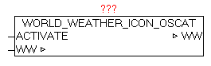

<!--
  Copyright (c) 2026 Hans Mühlbauer, Franz Höpfinger and others.

  This program and the accompanying materials are made available under the
  terms of the Eclipse Public License 2.0 which is available at
  https://www.eclipse.org/legal/epl-2.0

  SPDX-License-Identifier: EPL-2.0
-->

## WORLD_WEATHER_ICON_OSCAT

| | |
|:---|:---|
| **Type	Funktionsbaustein** |  |
| **IN_OUT	WW** | WORLD_WEATHER_DATA  (Wetterdaten) |
| **INPUT	ACTIVATE** | BOOL (positive Flanke startet die Übersetzung) |
| | Der Baustein ersetzt die originalen Anbieterspezifischen Wetter Icons-Nummern durch OSCAT-Standard Icon Nummern. Nach einer positiven Flanke bei ACTIVATE werden die Elemente (Icon-Nummern) in der WORLD_WEATHER_DATA Datenstruktur ersetzt. Nach erfolgter Abfrage der Wetterdaten mittels WORLD_WEATHER sollte dieser Baustein darauffolgend aufgerufen werden. Dabei kann einfach der Parameter DONE vom Baustein WORLD_WEATHER mit ACTIVATE verschalten werden. |
| **Folgende Elemente werden angepasst** |  |
| | WW.WORLD_WEATHER_CUR.WEATHER_ICON |
| | WW.WORLD_WEATHER_DAY[0..4].WEATHER_ICON |

