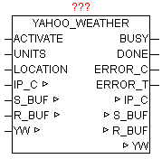

<!--
  Copyright (c) 2026 Hans Mühlbauer, Franz Höpfinger and others.

  This program and the accompanying materials are made available under the
  terms of the Eclipse Public License 2.0 which is available at
  https://www.eclipse.org/legal/epl-2.0

  SPDX-License-Identifier: EPL-2.0
-->

## YAHOO_WEATHER

| | |
|:---|:---|
| **Type	Funktionsbaustein** |  |
| **IN_OUT	IP_C** | IP_C (Parametrierungsdaten) |
| **S_BUF** | NETWORK_BUFFER  (Sendedaten) |
| **R_BUF** | NETWORK_BUFFER  (Empfangsdaten) |
| **YW** | YAHOO_WEATHER  (Wetterdaten) |
| **INPUT	ACTIVATE** | BOOL (positive Flanke startet die Abfrage) |
| **UNITS** | BOOL (FALSE = Celsius , TRUE = Fahrenheit) |
| **LOCATION** | STRING(20)  (Ortsangabe mittels LOCATION-ID) |
| **OUTPUT	BUSY** | BOOL  (Abfrage ist aktiv) |
| **DONE** | BOOL  (Abfrage ohne Fehler beendet) |
| **ERROR_C** | DWORD  (Fehlercode) |
| **ERROR_T** | BYTE  (Fehlertype) |
| **Der Baustein lädt die aktuellen Wetterdaten des angegebene Ortes mittels eines RSS feed (XML-Datenstruktur) von http** | //weather.yahooapis.com herunter, analysiert die XML-Daten und legt die wesentlichen Daten aufbereitet in der YAHOO_WEATHER Datenstruktur ab. Mit einer positiven Flanke von ACTIVATE wird die Abfrage gestartet und eine DNS Abfrage mit nachfolgender HTTP-GET durchgeführt. Nach erfolgreichen Empfang der Daten werden mittels XML_READER alle Elemente durchlaufen und wenn benötigt in der Datenstruktur in konvertierter Form abgelegt. Mit UNITS kann noch zwischen Fahrenheit und Celsius als Einheit gewählt werden. Durch Angabe der LOCATION_ID wird der genaue Ort des Wetters angegeben. Während die Abfrage aktiv ist, wird BUSY=TRUE ausgegeben. Nach erfolgreich beendeter Abfrage wird DONE=TRUE ausgegeben. Sollte bei der Abfrage ein Fehler auftreten so wird dieser unter ERROR_C gemeldet in Kombination mit ERROR_T. |
| **ERROR_T** |  |
| **Suchen der Location-ID eines bestimmten Ortes** |  |
| **Mittels Internet-Browser die Seite http** | //weather.yahoo.com/ aufrufen, und im Eingabefeld “Enter city or zip code:” den Namen des gesuchten Ortes eingeben, und mittels “Go” suchen bzw. Aufrufen. |
| | Nach erfolgreicher Auswahl werden im Browserfenster die aktuellen Wetterdaten des angegebenen Ortes angezeigt. In der URL (Web-Link) Zeile ist nun die Location-ID ersichtlich. |
| | Somit ergibt der gesuchte Ort „Wien (vienna)“ die Location-ID „551801“. Dieser Code muss am Baustein als Parameter übergeben werden. |
| | Aus den XML-Daten werden die benötigten Elemente aufbereitet und in der YAHOO_WEATHER Datenstruktur abgelegt. |

| Wert | Eigenschaften |
| --- | --- |
| 1 | Die genaue Bedeutung von ERROR_C ist beim Baustein DNS_CLIENT nachzulesen |
| 2 | Die genaue Bedeutung von ERROR_C ist beim Baustein HTTP_GET nachzulesen |
