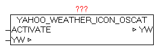

<!--
  Copyright (c) 2026 Hans Mühlbauer, Franz Höpfinger and others.

  This program and the accompanying materials are made available under the
  terms of the Eclipse Public License 2.0 which is available at
  https://www.eclipse.org/legal/epl-2.0

  SPDX-License-Identifier: EPL-2.0
-->

## YAHOO_WEATHER_ICON_OSCAT

| | |
|:---|:---|
| **Type	Funktionsbaustein** |  |
| **IN_OUT	YW** | YAHOO_WEATHER_DATA  (Wetterdaten) |
| **INPUT	ACTIVATE** | BOOL (positive Flanke startet die Übersetzung) |
| | Der Baustein ersetzt die originalen Anbieterspezifischen Wetter Icons-Nummern durch OSCAT-Standard Icon Nummern. Nach einer positiven Flanke bei ACTIVATE werden die Elemente (Icon-Nummern) in der YAHOO_WEATHER_DATA Datenstruktur ersetzt. Nach erfolgter Abfrage der Wetterdaten mittels YAHOO_WEATHER sollte dieser Baustein darauffolgend aufgerufen werden. Dabei kann einfach der Parameter DONE vom Baustein YAHOO_WEATHER mit ACTIVATE verschalten werden. |
| **Folgende Elemente werden angepasst** |  |
| | YW.CUR_CONDITIONS_ICON |
| | YW.FORCAST_TODAY_ICON |
| | YW.FORCAST_TOMORROW_ICON |

