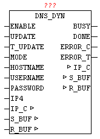

<!--
  Copyright (c) 2026 Hans Mühlbauer, Franz Höpfinger and others.

  This program and the accompanying materials are made available under the
  terms of the Eclipse Public License 2.0 which is available at
  https://www.eclipse.org/legal/epl-2.0

  SPDX-License-Identifier: EPL-2.0
-->

## DNS_DYN

| | |
|:---|:---|
| **Type** | Function module |
| **INPUT	ENABLE** | BOOL (release of the module) |
| **UPDATE** | BOOL (Launches new DNS registration immediately) |
| **T_UPDATE** | TIME (waiting time for new DNS registration) |
| **MODE** | BYTE (selection of DynDNS provider) |
| **HOST NAME** | STRING (30) (own domain name) |
| **USER NAME** | STRING(20) (name for registration) |
| **PASSWORD** | STRING(20) (password for registration) |
| **IP4** | DWORD (Optional specify the IP address) |
| **OUTPUT	BUSY** | BOOL (module is active, query is performed) |
| **DONE** | BOOL (performed DNS registration successful) |
| **ERROR_C** | DWORD (error code) |
| **ERROR_T** | BYTE (error type) |
| **IN_OUT	IP_C** | IP_C (parameterization) |
| **S_BUF** | NETWORK_BUFFER (transmit data) |
| **R_BUF** | NETWORK_BUFFER (receive data) |
| | WIth DNS_DYN dynamic IP addresses are registered as domain names. Many Internet providers assign a dynamic IP address when dialing into the Internet. To be visible and accessible for Internet  Participants, one of the ways is to upgrade its current IP address via Dyn-DNS. The process is not standardized, unfortunately, so for every Dyn-DNS provider has to be created a individual solution. The module can be used in conjunction with DynDNS.org and Selfhost.de. These providers offer in addition to paid also free DynDNS services. |
| | If ENABLE is set to TRUE, then the module is active. Using a   positive edge to UPDATE any time an update can be started. If at T_UPDATE a time is specified, always an update is done after that time. |
| | Caution, most DynDNS providers rates a frequent or unnecessary update as an attack, and block the account for a certain time. |
| | The time T_UPDATE should not be set below an hour. If the parameter T_UPDATE is not connect it is assumed as an update time of 1 hour. If no update is needed on time, then T#0ms should be passed. |
| | The MODE parameter allows the selection of DynDNS Provider |
| | (0 = DynDNS.org, 1 = SELFHOST.DE) |
| | The own domain name must be passed by the hostname. For security reasons, USERNAME and PASSWORD as authorization data must be specified to the DynDNS provider. If the parameter IP4 is not used, so DynDNS provider automatically adopts the current registration-IP as WAN IP with which the update is performed. By specifying an IP address also an individual IP address may be assigned. |
| | With flawless execution the parameter DONE = TRUE, else ERROR_C and ERROR_T passes the error code and error type. (See error codes). |
| **ERROR_T** |  |

| Value | Properties |
| --- | --- |
| 1 | The exact meaning of ERROR_C can be read at module DNS_CLIENT |
| 2 | The exact meaning of ERROR_C can be read at module HTTP_GET |
| 3 | The DynDNS provider has refused registration |
