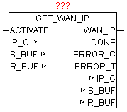

<!--
  Copyright (c) 2026 Hans Mühlbauer, Franz Höpfinger and others.

  This program and the accompanying materials are made available under the
  terms of the Eclipse Public License 2.0 which is available at
  https://www.eclipse.org/legal/epl-2.0

  SPDX-License-Identifier: EPL-2.0
-->

## Type	Function module:

| | |
|:---|:---|
| **INPUT	ACTIVATE** | BOOL (release for query) |
| **OUTPUT** | WAN_IP: DWORD (Wide Area Network address) |
| **DONE** | BOOL   (Query completed without errors) |
| **ERROR_C** | DWORD   (Error code) |
| **ERROR_T** | BYTE   (error type) |
| | The module determines the IP address that the Internet router on the Wide Area Network (Internet) uses. This IP address is necessary for example to    to make DynDNS declarations. With a positive edge of the ACTIVATE the request is started. After successful completion of the query DONE = TRUE, and the parameters WAN_IP  the current WAN IP address displayed. If an error occurs during the query it is reported in ERROR_C in combination with ERROR_T. |
| **ERROR_T** |  |

IN_OUT	IP_C: data structure 'IP_CONTROL '   (Parameterization)

S_BUF: data structure NETWORK_BUFFER '(transmit data)

R_BUF: data structure 'NETWORK_BUFFER '(receive data)

| Value | Properties |
| --- | --- |
| 1 | The exact meaning of ERROR_C can be read at module DNS_CLIENT |
| 2 | The exact meaning of ERROR_C can be read at module HTTP_GET |
