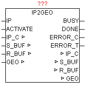

<!--
  Copyright (c) 2026 Hans Mühlbauer, Franz Höpfinger and others.

  This program and the accompanying materials are made available under the
  terms of the Eclipse Public License 2.0 which is available at
  https://www.eclipse.org/legal/epl-2.0

  SPDX-License-Identifier: EPL-2.0
-->

## IP2GEO

| | |
|:---|:---|
| **Type	Function module** |  |
| **IN_OUT	IP_C** | IP_C (parameterization) |
| **S_BUF** | NETWORK_BUFFER (transmit data) |
| **R_BUF** | NETWORK_BUFFER (receive data) |
| **GEO** | IP2GEO (Geographic Data) |
| **INPUT	ACTIVATE** | BOOL (release for query) |
| **OUTPUT	BUSY** | BOOL   (Query is active) |
| **DONE** | BOOL   (Query completed without errors) |
| **ERROR_C** | DWORD   (Error code) |
| **ERROR_T** | BYTE   (error type) |
| | The device supplies because of the wide-area network IP address, the geographic information of the Internet access. As the WAN IP addresses are registered worldwide, therefore can be determined the approximate geographical position of the PLC. Should access runs through a proxy server, so its geographic position is determined and not the PLC. Usually, but normally it is in the nearness of the PLC, and thus the deviation is not relevant. This results in calculated positions differ only a few miles from the true position, and is relatively accurate. |
| | If the parameter "IP" specifies no IP address, automatically the current WAN IP is used, otherwise the information of the configured IP delivered. With a positive edge of the ACTIVATE the request is started. As long as the query is not complete, BUSY = TRUE is passed. After successful completion of the query DONE = TRUE, and the parameters WAN_IP  the current WAN IP address displayed. If an error occurs during the query it is reported in ERROR_C in combination with ERROR_T. |
| **ERROR_T** |  |
| **The "country_code is coded according to ISO 3166 country code ALPHA-2".  http** | //www.iso.org/iso/english_country_names_and_code_elements http://de.wikipedia.org/wiki/ISO-3166-1-Kodierliste |
| **The "REGION_CODE" is coded to "FIPS region code".  http** | //en.wikipedia.org/wiki/List_of_FIPS_region_codes |

| Value | Properties |
| --- | --- |
| 1 | The exact meaning of ERROR_C can be read at module DNS_CLIENT |
| 2 | The exact meaning of ERROR_C can be read at module HTTP_GET |
