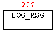

<!--
  Copyright (c) 2026 Hans Mühlbauer, Franz Höpfinger and others.

  This program and the accompanying materials are made available under the
  terms of the Eclipse Public License 2.0 which is available at
  https://www.eclipse.org/legal/epl-2.0

  SPDX-License-Identifier: EPL-2.0
-->

## LOG_MSG

| | |
|:---|:---|
| **Type	Function module** |  |
| **IN_OUT	LOG_CL** | LOG_CONTROL (log-data) |
| | With LOG_MSG messages (STRINGS) are stored in a ring buffer. The messages can be provided with additional parameters such as the front color and back color for the output to TELNET and a filter by specifying an entry-level news. Is the level of the message larger than the default log level, the message is discarded. Furthermore,with Enable the logging will be disabled in general. Thus, it is not a problem to archive many messages per PLC cycle. The message buffer can be passed to a telnet client with the module TELNET_LOG. Details on the interface are shown in the table below. |
| | If messages are applied from various module instances to the same LOG_BUFFER, then the "LOG_CL" data structure has to be created Global. |

