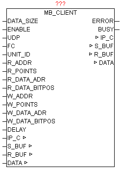

<!--
  Copyright (c) 2026 Hans Mühlbauer, Franz Höpfinger and others.

  This program and the accompanying materials are made available under the
  terms of the Eclipse Public License 2.0 which is available at
  https://www.eclipse.org/legal/epl-2.0

  SPDX-License-Identifier: EPL-2.0
-->

## MB_CLIENT  (OPEN MODBUS)

| | |
|:---|:---|
| **Type	Function module** |  |
| **IN_OUT	IP_C** | IP_C (parameterization) |
| **S_BUF** | NETWORK_BUFFER_SHORT (transmit data) |
| **R_BUF** | NETWORK_BUFFER_SHORT (receive data) |
| **DATA** | ARRAY [0..255] OF WORD (MODBUS Register) |
| **INPUT	DATA_SIZE** | INT (number of data words in structure MB_DATA) |
| **ENABLE** | BOOL (release) |
| **UDP** | BOOL   (Prefix  TCP / UDP, UDP = TRUE  ) |
| **FC** | INT (function number) |
| **UNIT_ID** | BYTE (Device ID) |
| **R_ADDR** | INT (Read command: MODBUS data point address) |
| **R_POINTS** | INT (Read command: MODBUS number of data points) |
| **R_DATA_ADR** | INT (Read command: DATA data point address) |
| **R_DATA_BITPOS** | INT (read command: DATA data point bitpos.) |
| **W_ADDR** | INT (Read command: MODBUS data point address) |
| **W_POINTS** | INT (Read command: MODBUS number of data points) |
| **W_DATA_ADR** | INT (Read command: DATA data point address) |
| **W_DATA_BITPOS** | INT (read command: DATA data point bit pos.) |
| **DELAY** | TIME (repetition time) |
| **OUTPUT	ERROR** | DWORD (error code) |
| **BUSY** | BOOL (module is active) |
| | The module provides access to Ethernet devices, the MODBUS TCP or MODBUS UDP supported, or MODBUS RS232/485 devices are connected via Ethernet Modbus gateway. There commands from   Classes 0,1,2 are supported. The parameters IP_C, S_BUF, R_BUF this form the interface to the module IP_CONTROL and used here for processing and coordination. The desired   IP address and port number (for MODBUS default is 502) must be specified on IP_CONTROL centrally. The DATA structure is designed as a WORD array and contains the MODBUS data for reading and writing. The size of the WORD_ARRAY is given by DATA_SIZE.  By ENABLE, the module is released, and by remove of the release a possibly still active query is ended. For devices that support MODBUS with UDP = TRUE this mode can be activated. The parameter UNIT_ID must only at use of Ethernet Modbus provided. The desired function is specified by FC (see function code table). Depending on the function, the R_xxx and W_xxx parameters has to be supplied with data. By specifying the DELAY   the repetition time can be specified. If not specify the time an attempt is made as often as possible to execute the command. The integrated access management automatically guarantees to get the other module instances also to the series. A negative command execution is reported by ERROR (see ERROR-table). If the module actively performs a query, then  BUSY = TRUE will be passed during this time. |
| **Supported function codes and parameters used** |  |
| **ERROR** |  |

| Function Code | Bit Access | 16 Bit Access (Register) | Group | Function  Description | R_ADDR | R_POINTS | R_DATA_ADR | R_DATA_BITPOS | W_ADDR | W_POINTS | W_DATA_ADR | W_DATA_BITPOS |
| --- | --- | --- | --- | --- | --- | --- | --- | --- | --- | --- | --- | --- |
| 1 | x |  | Coils | Read Coils | x | x | x | x |  |  |  |  |
| 2 | x |  | Input Discrete | Read Discrete Inputs | x | x | x | x |  |  |  |  |
| 3 |  | x | Holding Register | Read Holding Registers | x | x | x |  |  |  |  |  |
| 4 |  | x | Input Register | Read Input Register | x |  | x |  |  |  |  |  |
| 5 | x |  | Coils | Write Single Coil |  |  |  |  | x |  | x | x |
| 6 |  | x | Holding Register | Write Single Register |  |  |  |  | x |  | x |  |
| 15 | x |  | Coils | Write Multiple Coils |  |  |  |  | x | x | x | x |
| 16 |  | x | Holding Register | Write Multiple Register |  |  |  |  | x | x | x |  |
| 22 |  | x | Holding Register | Mask Write Register |  |  |  |  | x |  | x |  |
| 23 |  | x | Holding Register | Read/Write Multiple Register | x | x | x |  | x | x | x |  |

| Value | Source | Description |
| --- | --- | --- |
| B3 | B2 | B1 | B0 |  |  |
| nn | nn | nn | xx | IP_CONTROL | Error from module IP_CONTROL |
| xx | xx | xx | 00 | MB_CLIENT | No Error |
| xx | xx | xx | 01 | MB_CLIENT | ILLEGAL FUNCTION:The function code received in the query is not an allowable action for the server (or slave). This may be because the function code is only applicable to newer devices, and was not implemented in the unit selected. It could also indicate that the server (or slave) is in the wrong state to process a request of this type, for example because it is unconfigured and is being asked to return register values. |
| xx | xx | xx | 02 | MB_CLIENT | ILLEGAL DATA ADDRESS:The data address received in the query is not an allowable address for the server (or slave). More specifically, the combination of reference number and transfer length is invalid. For a controller with 100 registers, the PDU addresses the first register as 0, and the last one as 99. If a request is submitted with a starting register address of 96 and a quantity of registers of 4, then this request will successfully operate (address-wise at least) on registers 96, 97, 98, 99. If a request is submitted with a starting register address of 96 and a quantity of registers of 5, then this request will fail with Exception Code 0x02 “Illegal Data Address” since it attempts to operate on registers 96, 97, 98, 99 and 100, and there is no register with address 100. |
| xx | xx | xx | 03 | MB_CLIENT | ILLEGAL DATA VALUE:A value contained in the query data field is not an allowable value for server (or slave). This indicates a fault in the structure of the remainder of a complex request, such as that the implied length is incorrect. It specifically does NOT mean that a data item submitted for storage in a register has a value outside the expectation of the application program, since the MODBUS protocol is unaware of the significance of any particular value of any particular register. |
| xx | xx | xx | 04 | MB_CLIENT | SLAVE DEVICE FAILURE:An unrecoverable error occurred while the server (or slave) was attempting to perform the requested action. |
| xx | xx | xx | 05 | MB_CLIENT | ACKNOWLEDGE:Specialized use in conjunction with programming commands. The server (or slave) has accepted the request and is processing it, but a long duration of time will be required to do so. This response is returned to prevent a timeout error from occurring in the client (or master). The client (or master) can next issue a Poll Program Complete message to determine if processing is completed. |
| xx | xx | xx | 06 | MB_CLIENT | SLAVE DEVICE BUSY:Specialized use in conjunction with programming commands. The server (or slave) is engaged in processing a long–duration program command. The client (or master) should retransmit the message later when the server (or slave) is free. |
| xx | xx | xx | 8 | MB_CLIENT | MEMORY PARITY ERROR:Specialized use in conjunction with function codes 20 and 21 and reference type 6, to indicate that the extended file area failed to pass a consistency check.The server (or slave) attempted to read record file, but detected a parity error in the memory.The client (or master) can retry the request, but service may be required on the server (or slave) device. |
| xx | xx | xx | 0A | MB_CLIENT | GATEWAY PATH UNAVAILABLE:Specialized use in conjunction with gateways, indicates that the gateway was unable to allocate an internal communication path from the input port to the output port for processing the request. Usually means that the gateway is misconfigured or overloaded. |
| xx | xx | xx | 0B | MB_CLIENT | GATEWAY TARGET DEVICE FAILED TO RESPOND:Specialized use in conjunction with gateways, indicates that no response was obtained from the target device. Usually means that the device is not present on the network. |
