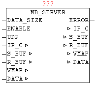

<!--
  Copyright (c) 2026 Hans Mühlbauer, Franz Höpfinger and others.

  This program and the accompanying materials are made available under the
  terms of the Eclipse Public License 2.0 which is available at
  https://www.eclipse.org/legal/epl-2.0

  SPDX-License-Identifier: EPL-2.0
-->

## MB_SERVER (OPEN-MODBUS)

| | |
|:---|:---|
| **Type	Function module** |  |
| **IN_OUT	IP_C** | IP_C (parameterization) |
| **S_BUF** | NETWORK_BUFFER_SHORT (transmit data) |
| **R_BUF** | NETWORK_BUFFER_SHORT (receive data) |
| **VMAP** | ARRAY [1..10] OF VMAP_DATA (virtual address table) |
| **DATA** | ARRAY [0..255] OF WORD (MODBUS Register) |
| **INPUT	DATA_SIZE** | INT (number of data words in DATA) |
| **ENABLE** | BOOL (release) |
| **UDP** | BOOL   (Prefix  TCP / UDP, UDP = TRUE  ) |
| **OUTPUT	ERROR** | DWORD (error code) |
| | The module provides access from external to local MODBUS data tables via Ethernet. It supports commands in categories 0,1,2. The parameters IP_C, S_BUF, R_BUF this form the interface to the module IP_CONTROL and used here for processing and coordination. The desired   port number (for MODBUS default is 502) must be specified on IP_CONTROL centrally. The IP address is not required on IP_CONTROL, as this one operates in the PASSIVE mode. The DATA structure is designed as a WORD array and contains the MODBUS data. DATA_SIZE specifies the size of   DATA . By ENABLE, the module is released, and by remove of the release a possibly still active query is ended. For devices that support MODBUS with UDP = TRUE this mode can be activated. A negative command execution is reported by ERROR (see ERROR table). |
| | WIth entries in the data structure VMAP, virtual data areas are created, and the access to certain function codes and data regions is parameterized. Thus, it is very easy to map virtual address spaces into a coherent  Data block (DATA), or write data areas. Or provide areas, that are connected to output peripherals, with a watchdog. |
| | The handling of the VMAP data is described in more detail in the module MB_VMAP. |
| **ERROR** |  |
| **Supported function codes and parameters used** |  |

| Value | Source | Description |
| --- | --- | --- |
| B3 | B2 | B1 | B0 |  |  |
| nn | nn | nn | xx | IP_CONTROL | Error from module IP_CONTROL |
| xx | xx | xx | 00 | MB_SERVER | NO ERROR: |
| xx | xx | xx | 01 | MB_SERVER | ILLEGAL FUNCTION: |
| xx | xx | xx | 02 | MB_SERVER | ILLEGAL DATA ADDRESS: |
| xx | xx | xx | 03 | MB_SERVER | ILLEGAL DATA VALUE: |

| Function Code | Bit Access | 16 Bit Access (Register) | Group | Function  Description |
| --- | --- | --- | --- | --- |
| 1 | x |  | Coils | Read Coils |
| 2 | x |  | Input Discrete | Read Discrete Inputs |
| 3 |  | x | Holding Register | Read Holding Registers |
| 4 |  | x | Input Register | Read Input Register |
| 5 | x |  | Coils | Write Single Coil |
| 6 |  | x | Holding Register | Write Single Register |
| 15 | x |  | Coils | Write Multiple Coils |
| 16 |  | x | Holding Register | Write Multiple Register |
| 22 |  | x | Holding Register | Mask Write Register |
| 23 |  | x | Holding Register | Read/Write Multiple Register |
