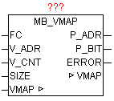

<!--
  Copyright (c) 2026 Hans Mühlbauer, Franz Höpfinger and others.

  This program and the accompanying materials are made available under the
  terms of the Eclipse Public License 2.0 which is available at
  https://www.eclipse.org/legal/epl-2.0

  SPDX-License-Identifier: EPL-2.0
-->

## MB_VMAP

| | |
|:---|:---|
| **Type	Function module** |  |
| **IN_OUT	VMAP** | ARRAY [1..10] OF VMAP_DATA (VIRTUAL_MAP Data) |
| **INPUT	FC** | INT (function number) |
| **V_ADR** | INT (virtual address range start address) |
| **V_CNT** | INT (Virtual address space: number of data points) |
| **SIZE** | INT (number of MODBUS registers in structure DATA) |
| **OUTPUT** | P_ADR: INT (  Real address space: Start address  ) |
| **P_BIT** | INT (real address range: bit position) |
| **ERROR** | DWORD (error code) |
| | The module allows the conversion of virtual addresses at a real address space in the MODBUS DATA   Structure.  Virtual address ranges are defined in the VMAP data array. If the module is called and found that nothing in the VMAP data is entered, automatically a block is created, allowing full access to all the MODBUS data. In each address block also a watchdog timer is maintained that sets each time you access this block on the timer to zero. Thus, simply by comparing the TIME_OUT value to a cutoff value, at communication error (no update) can be responded. |
| | By the parameter FC is detected the functional code and whether the register (16 bit) or individual bits must be processed. The bit number corresponds to the function code. This means that   Bit5 = 1 in FC the function code 5 (Write Single Coil) enables.   By V_ADR by the virtual start address is specified (At 16bit commands this is a register address and at bit commands an absolute bit number within a defined block.) The parameter V_CNT defines the number of data points (unit 16-bit or bits depending on the function code). The overall size is given by MODBUS_ARRAY SIZE (number WORDS). By  using these parameters, the  module searched the VMAP data table for a matching block of data, and passes from the correct data block P_ADR as a result. The value corresponds to the real index for MODBUS_DATA array. At a function code with bit access in addition the bit position within P_ADR is passed as well. A potential error occurring in the analysis is reported for the parameter "error" (see error table). The watchdog timer is reseted at each access to a function code from the group of write commands. |
| **If no special treatment required, so in VMAP are not settings required, and then MODBUS_ARRAY is mapped 1** | 1 with the access. |
| **ERROR** |  |
| | ! Note the special treatment of function code 23! |
| | The Modbus Function Code 23 is a combined command, because it consists of two actions. First register are written and then the register are read. Found that the write or read parameter is not allowed, so neither of these actions is performed. |
| | To distinguish between reading and writing by VMAP, the read command is checked in VMAP at FC 23 as BIT23 (Read/Write Multiple registers), and the write command on the other hand, is tested in Bit16 (Write multiple registers). |

**Example:**

Example Configuration

(* Virtual block 1 *)

VMAP[1].FC := DWORD#2#00000000_10000000_00000000_00011100); (FC 2,3,4,23)

VMAP[1].V_ADR := 1;	 (*  Virtual Address Range: Start address  *)

VMAP[1].V_SIZE := 4;	 (*  Virtual address space: number of WORD  *)

VMAP[1].P_ADR := 1;	 (* Real address space: Start address  *)

(*  Virtual Block 2 *)

VMAP[2].FC := DWORD#2#00000000_10000000_00000000_00011000); (FC 3,4,23)

VMAP [2] V_ADR. = 101;  (*  Virtual Address Range: Start address  *)

VMAP[2].V_SIZE := 4;	 (*  Virtual address space: number of WORD  *)

VMAP[2].P_ADR := 5;	 (* Real address space: Start address  *)

(*  Virtual Block 3 *)

VMAP[3].FC := DWORD#2#00000000_11000001_10000000_01111010);(FC1,3-6,15-16,23)

VMAP [3] V_ADR. = 201;  (*  Virtual Address Range: Start address  *)

VMAP[3].V_SIZE := 4;	 (*  Virtual address space: number of WORD  *)

VMAP[3].P_ADR := 9;	 (* Real address space: Start address  *)

(*  Virtual Block 4 *)

VMAP[4].FC := DWORD#2#00000000_11000001_00000000_01011000); (FC 3,4,6,16,23)

VMAP [4] V_ADR. = 301;  (*  Virtual Address Range: Start address  *)

VMAP[4].V_SIZE := 4;	 (*  Virtual address space: number of WORD  *)

VMAP[4].P_ADR := 12;	(* Real address space: home address *)

The configuration is following access matrix:

| Value | Description |
| --- | --- |
| 0 | No error |
| 1 | Invalid function code |
| 2 | Invalid Data Address |

| Function  Description | Function Code | Bit Access | 16 Bit Access (Register) | Read / Write | Digital Input | Analog Input | Digital Output | Analog Output |
| --- | --- | --- | --- | --- | --- | --- | --- | --- |
| Read Coils | 1 | x |  | Read |  |  | x |  |
| Read Discrete Inputs | 2 | x |  | Read | x |  |  |  |
| Read Holding Registers | 3 |  | x | Read | x | x | x | x |
| Read Input Register | 4 |  | x | Read | x | x | x | x |
| Write Single Coil | 5 | x |  | Schreiben |  |  | x |  |
| Write Single Register | 6 |  | x | Schreiben |  |  | x | x |
| Write Multiple Coils | 15 | x |  | Schreiben |  |  | x |  |
| Write Multiple Register | 16 |  | x | Schreiben |  |  | x | x |
| Mask Write Register | 22 |  | x | Schreiben |  |  |  |  |
| Read/Write Multiple Register | 23 |  | x | Read / Write | x | x | x | x |
