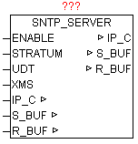
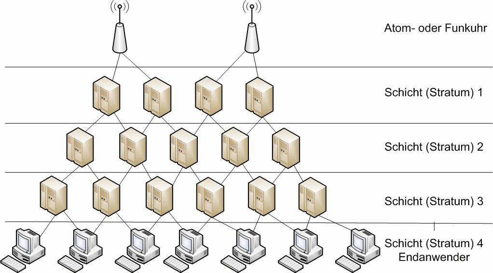

<!--
  Copyright (c) 2026 Hans Mühlbauer, Franz Höpfinger and others.

  This program and the accompanying materials are made available under the
  terms of the Eclipse Public License 2.0 which is available at
  https://www.eclipse.org/legal/epl-2.0

  SPDX-License-Identifier: EPL-2.0
-->

## SNTP_SERVER

| | | |
|:---|:---|:---|
| **Type	Function module** |  | |
| **IN_OUT	IP_C** | IP_C (parameterization) | |
| **S_BUF** | NETWORK_BUFFER (transmit data) | |
| **R_BUF** | NETWORK_BUFFER (receive data) | |
| **INPUT	ENABLE** | BOOL (Starts SNTP server) | |
| **STRATUM** | BYTE (specify the hierarchical level or | accuracy) |
| **UDT** | DT (Date and time input as Universal Time) | |
| **XMS** | INT (millisecond of Universal Time UDT) | |
| | The module provides the functionality of an SNTP (NTP) server. With ENABLE = TRUE the module logs in at IP_CONTROL and waits for the release of the resource, if it occupied by other subscribers for now. Then the module is waiting for requests from other SNTP clients and answers it with the current time of UDT and XMS. As long as ENABLE = TRUE, the Ethernet access of this resource is permanently locked for other users (Exclusive Access   - due to passive UDP mode). SNTP uses a hierarchical system of different strata. As stratum 0 is defined as the exact time standard. The directly coupled systems, such as NTP, GPS or DCF77 time signals are called Stratum 1.Each additional dependent unit causes an additional time lag of 10-100ms and is designate with a higher number (Stratum 2, Stratum 3 to 255). If no STRATUM is specified at the module, STRATUM = 1 is used as a standard. | |
| | If an SNTP client itself has a time with a higher stratum than an SNTP server, the time of this is sometimes rejected because it is less accurate than their own reference. It is therefore important to specify a logically correct STRATUM. The module SNTP_CLIENT ignores deliberately the STRATUM and synchronizes in each case with the SNTP server, because pretty much everyone SNTP server as a more precise time than a PLC. | |

