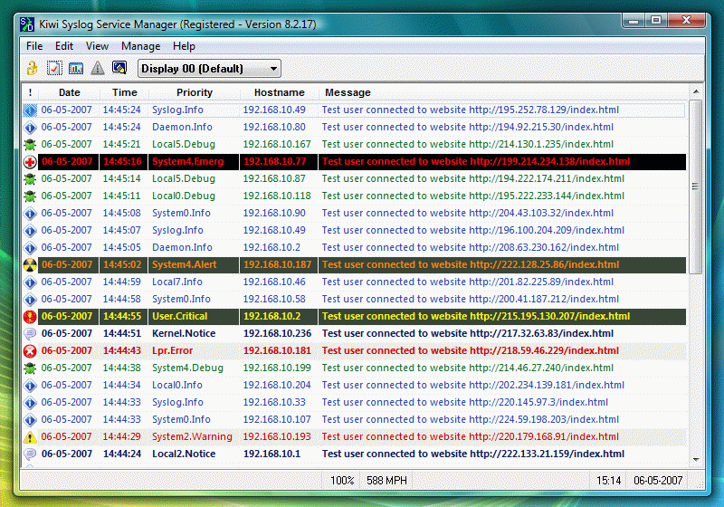

<!--
  Copyright (c) 2026 Hans Mühlbauer, Franz Höpfinger and others.

  This program and the accompanying materials are made available under the
  terms of the Eclipse Public License 2.0 which is available at
  https://www.eclipse.org/legal/epl-2.0

  SPDX-License-Identifier: EPL-2.0
-->

## SYS_LOG

| | |
|:---|:---|
| **Type	Function module** |  |
| **IN_OUT	IP_C** | IP_C (parameterization) |
| **S_BUF** | NETWORK_BUFFER (transmit data) |
| **R_BUF** | NETWORK_BUFFER (receive data) |
| **INPUT	ACTIVATE** | BOOL (positive edge starts the query) |
| **LDT** | DT (local time) |
| **SERVER_IP4** | DWORD   (IP address of the syslog server) |
| **PORT** | WORD   (Port number of the syslog server) |
| **FACILITY** | BYTE   (specifies the service or component) |
| **SEVERITY** | BYTE   (Classification of severity) |
| **TAG** | STRING(32)   (Process name, ID, etc.) |
| **HOST NAME** | STRING   (Name or IP address of the sender) |
| **MESSAGE** | STRING(string_length)   (Message) |
| | OPTION BYTE   (Various   ) |
| **OUTPUT	DONE** | BOOL   (Query completed without errors) |
| **ERROR** | DWORD   (Error code) |
| | SYSLOG is a standard for transmitting messages in an IP computer network. The protocol is very simple - the client sends a short text message to the syslog receiver. The receiver is also called "syslog daemon" or "syslog server". The messages are sent using UDP port 514 or TCP port 1468 and includes the message in plain text. SYSLOG is typical  used for computer systems management and security surveillance. This enables the easy integration of various log sources to a central syslog server. The server software is available for all platforms, sometimes known as free / shareware. Unix or Linux systems have a syslog server already integrated. Through a positive edge at ACTIVATE from the parameters of  LDT, FACILITY, SEVERITY, TAG, HOST NAME, MESSAGE a syslog message is generated and sent to the   SERVER_IP4 mail address. With OPTION various properties can still be controlled (See Table OPTION). After successfully sending DONE gets TRUE, otherwise ERROR is issued when the actual error message (See ERROR of module IP_CONTROL). |
| | FACILITY,SEVERITY,TIMESTAMP,HOSTNAME,TAG,MESSAGE |

**Example:**

Example:

MAIL.ERR: Sep 10 08:31:10 149.100.100.02 PLANT2_PLC1 This is a test message generated by OSCAT SYSLOG

The following options can be used

Severity is defined as the following standard:

The following facility is defined as standard:

For general syslog messages, the facility values 16-23 are provided (local0 to local7). But it is quite permissible to use the predefined values from 0 to 15 for own purposes.

With Facility and Severity can be filtered on the SYSLOG server (database)   according to certain reports, such as: "Record all error messages from the mail server with severity level.

Example (screenshot) of a syslog server for Windows

| BIT | Function |
| --- | --- |
| 0 | FALSE = with Facility, Severity codeTRUE = No Facility, Severity code |
| 1 | FALSE = with RFC headerTRUE =  without RFC Header (only the MESSAGE alone sent) |
| 2 | FALSE = with CR,LF at endTRUE = without CR,LF end |
| 3 | FALSE = UDP ModusTRUE = TCP Modus |

| Severity | Description |
| --- | --- |
| 0 | Emergency |
| 1 | Alert |
| 2 | Critical |
| 3 | Error |
| 4 | Warning |
| 5 | Notice |
| 6 | Informational |
| 7 | Debug |

| Facility | Description |
| --- | --- |
| 00 | Kernel message |
| 01 | user-level messages |
| 02 | mail system |
| 03 | system daemons |
| 04 | security/authorization messages |
| 05 | messages generated internally by syslogd |
| 06 | line printer subsystem |
| 07 | network news subsystem |
| 08 | UUCP subsystem |
| 09 | clock daemon |
| 10 | security/authorization messages |
| 11 | FTP daemon |
| 12 | NTP subsystem |
| 13 | log audit |
| 14 | log alert |
| 15 | clock daemon |
| 16 | local10 |
| 17 | local11 |
| 18 | local12 |
| 19 | local13 |
| 20 | local14 |
| 21 | local15 |
| 22 | local16 |
| 23 | local17 |
