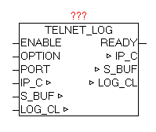

<!--
  Copyright (c) 2026 Hans Mühlbauer, Franz Höpfinger and others.

  This program and the accompanying materials are made available under the
  terms of the Eclipse Public License 2.0 which is available at
  https://www.eclipse.org/legal/epl-2.0

  SPDX-License-Identifier: EPL-2.0
-->

## TELNET_LOG

| | |
|:---|:---|
| **Type	Function module** |  |
| **IN_OUT	IP_C** | IP_C (parameterization) |
| **S_BUF** | NETWORK_BUFFER (transmit data) |
| **LOG_CL** | LOG_CONTROL (log-data) |
| **INPUT	S_BUF_SIZE** | UINT (  Size of S_BUF  ) |
| **ENABLE** | BOOL   (TELNET server released) |
| **OPTION** | BYTE (Send Options) |
| **PORT** | WORD (Port Nummer) |
| **OUTPUT	READY** | BOOL   (TELNET client has established connection) ) |
| | TELNET_LOG is used to pass all the messages in the ring LOG_CONTROL-buffer over TELNET. By "ENABLE", the module can be activated. At parameter PORT the desired port number can be defined. If the parameter is not defined the default port is 23. |
| **With OPTION various properties can still be controlled (See Table OPTION). If the parameter OPTION is not connected the following default is assumed** |  |
| | OPTION = BYTE#2#1000_1100; |
| | As soon as a Telnet client connects this is indicated by parameter "READY". Then be automatically all messages are passed to TELNET. Once occurred new reports in the course in LOG_CONTROL they are always passed automatically. When a new connection from/to rebuilds, all messages will be passed again. Most TELNET clients offer the opportunity to redirect the data stream to a file, just to make a long-term data archiving. |
| **OPTION** |  |

| BIT | Function | Description |
| --- | --- | --- |
| 0 | SCREEN_INIT | After connecting to the TELNET console the entire screen is cleared.   If the COLOR OPTION is selected, the screen BACK_COLOR will be deleted. |
| 1 | AUTOWRAP | In AUTOWRAP = 1, the write cursor is on reaching the end of line is automatically set to a next line. If the text output the X,Y positions are always specified with, it is better when AUTOWRAP = 0. |
| 2 | COLOR | Enables the color mode, it will  apply BACK_COLOR and FRONT_COLOR  to the output. |
| 3 | NEW_LINE | In NEW_LINE = 1 is automatically a carriage return and line feed added to the end of the text. So the next text output starts a new line. But this is only useful if no X_pos and Y_pos be specified. |
| 4 | RESERVE |  |
| 5 | RESERVE |  |
| 6 | RESERVE |  |
| 7 | NO_BUF_FLUSH | Prevents the data in the buffer to be sent immediately. Only if the buffer is completely full, or this option is disabled, the data is sent. Allows   fast sending many texts in the same cycle |
