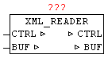
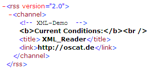
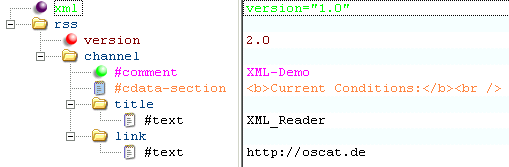
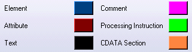

<!--
  Copyright (c) 2026 Hans Mühlbauer, Franz Höpfinger and others.

  This program and the accompanying materials are made available under the
  terms of the Eclipse Public License 2.0 which is available at
  https://www.eclipse.org/legal/epl-2.0

  SPDX-License-Identifier: EPL-2.0
-->

## XML_READER

| | | |
|:---|:---|:---|
| **Type	Function module** |  | |
| **IN_OUT	CTRL** | XML_CONTROL | |
| | (Control and status data) | |
| **BUF** | NETWORK_BUFFER   (Receive data) | |
| | XML_READER means it is possible to parse so-called 'well-formed' XML documents. Here, not as usual at high-level languages, the whole XML data is read as a data structure and stored in memory, but a very resource-friendly version is used. The XML_READER reads XML data as a sequential data stream from the buffer and signals the in COMMAND defined element types automatically back. | |
| | With XML is a strict distinction between upper and lower case. An XML document consists of just elements, attributes, their assignments, and the contents of the elements that can be text or child elements, which in turn can have attributes with assigned values and content. There are elements with and without attributes, elements can consist of many other elements, and those that may occur within the text only, and even empty elements that may have no content. The structure that emerges from these elements and their principles can be understood as a tree structure. Elements always consist of tags and end tags. Attributes are additional information about items. Comment elements are also allowed; however, these may not be between the start and end tags of elements in XML_READER. A possible DTD (Document Type Definition) will only be reported as DTD, but not further evaluated and applied by XML_READER. With a CDATA section, a parser is told that no markup follows, but normal text which is reported by start-end block. | |
| | Before the first call of the XML_READER a few parameters in the CTRL data structure needs to be initialized.  CTRL.START_POS and CTRL.STOP_POS defines the beginning and the end of the XML data in the buffer. CTRL.COMMAND with one hand, can be an initialization  (Bit15 = TRUE) and with bit 0-14 can be defined which element / data types are reported. Here the type codes in the following table corresponds just the bit number, which has to be set to True in CTRL.COMMAND. | |
| | It is tried to pass the text of element, attribute, Value and Path in total length to the accompanying STRINGS. In STRINGS greater than 255 characters this will be cut off flush left, but with block-start and block-end parameters is reported back, so that they can subsequently be evaluated yet complete. The BLOCK-START/STOP index is always passed parallel to the STRINGS. If the PATH STRING is greater than 255 characters so the PATH tracking is disabled and only "OVERFLOW" is entered as text. | |
| | Since for very large and complex XML data is not clear, how long it takes until the module find data to report back, an  WATCHDOG function is integrated. A maximum processing time can be parameterized. When reaching  the time limit the module call is automatically canceled, and the next cycle resumes at the same point. The type code 98 is returned. | |
| | The following type codes are defined. | |
| | Sample XML | |
| | flat display | |
| **<?xml version="1.0" ?><rss version="2.0"><channel><!-- XML-Demo --><![CDATA[<b>CurrentConditions** | </b> ]]><title>XML_Reader</title> <link>http://oscat.de</link></channel></rss> | |
| | Representation of the levels (without processing Instruction  ) | |
| | View as tree of item types | |
| **Legend** |  | |
| **Application example** |  | |
| | CASE STATE OF | |
| **00** |  | |
| **STATE** | = 10; | |
| **CTRL.START_POS** | = HTTP_GET.BODY_START; (Index of first character *) | |
| **CTRL.STOP_POS** | = HTTP_GET.BODY_STOP;  (Index of last character *) | |
| **CTRL.COMMAND** | = WORD#2#11111111_11111111; (* Init + report all elements *) | |
| **10** |  | |
| | (* XML * data read serial) | |
| **XML_READER.CTRL** | = CTRL; | |
| **XML_READER.BUF** | = BUFFER; | |
| | XML_READER(); | |
| **CTRL** | = XML_READER.CTRL; | |
| **BUFFER** | = XML_READER.BUF; | |
| | IF CTRL.TYP = 99 THEN | |
| **STATE** | = 20; (* Exit – no further elements available *) | |
| | ELSIF CTRL.TYP < 98 THEN (* do nothing at timeout(Code 98) *) | |
| | (* Evaluation of the XML elements by accessing the CTRL data structure *) | |
| | END_IF; | |
| **20** |  | |
| | (* miscellaneous...... *) | |
| | END_CASE; | |
| | The following information is passed via the CTRL-data structure | |
| **--------First pass --------  COUNT** | 1 TYPE: | 5 	(OPEN ELEMENT - PROCESSING INSTRUCTION) LEVEL: 		1 ELEMENT: 		'xml' PATH: 		'/xml' --------Next cycle-------- COUNT:		2 TYPE: 		4 	(ATTRIBUTE) LEVEL:		1 ELEMENT: 		'xml' ATTRIBUTE:		'version' VALUE:		'1.0' PATH: 		'/xml' --------Next cycle-------- COUNT:		3 TYPE: 		2 	(CLOSE ELEMENT) LEVEL: 		0 ELEMENT: 		'xml' PATH: 		'' --------Next cycle-------- COUNT:		4 TYPE: 		1 	(OPEN ELEMENT - Standard) LEVEL: 		1 ELEMENT: 		'rss' PATH: 		'/rss' --------Next cycle-------- COUNT:		5 TYPE: 		4 	(ATTRIBUTE) LEVEL:		1 ELEMENT: 		'rss' ATTRIBUTE:		'version' VALUE:		'2.0' PATH: 		'/rss' --------Next cycle-------- COUNT:		6 TYPE: 		1 	(OPEN ELEMENT - Standard) LEVEL: 		2 ELEMENT: 		'channel' PATH: 		'/rss/channel' --------Next cycle-------- COUNT:		7 TYPE: 		13 	(COMMENT-ELEMENT) LEVEL: 		2 VALUE: 		' XML-Demo ' PATH: 		'/rss/channel' --------Next cycle-------- COUNT:		8 TYPE: 		12 	(CDATA) LEVEL: 		2 VALUE: 		'<b>Current Conditions:</b> ' PATH: 		'/rss/channel' --------Next cycle-------- COUNT:		9 TYPE: 		1 	(OPEN ELEMENT - Standard) LEVEL: 		3 ELEMENT: 		'title' PATH: 		'/rss/channel/title' --------Next cycle-------- COUNT:		10 TYPE: 		3	(TEXT) LEVEL: 		3 ELEMENT: 		'title' VALUE: 		' XML_Reader' PATH: 		'/rss/channel/title' --------Next cycle-------- COUNT:		11 TYPE: 		2 	(CLOSE ELEMENT) LEVEL: 		2 ELEMENT: 		'title' PATH: 		'/rss/channel' --------Next cycle-------- COUNT:		12 TYPE: 		1 	(OPEN ELEMENT - Standard) LEVEL: 		3 ELEMENT: 		'link' PATH: 		'/rss/channel/link' --------Next cycle-------- COUNT:		13 TYPE: 		3	(TEXT) LEVEL: 		3 ELEMENT: 		'link' VALUE: 		'http://oscat.de' PATH: 		'/rss/channel/link' --------Next cycle-------- COUNT:		14 TYPE: 		2 	(CLOSE ELEMENT) LEVEL: 		2 ELEMENT: 		'link' PATH: 		'/rss/channel' --------Next cycle-------- COUNT:		15 TYPE: 		2 	(CLOSE ELEMENT) LEVEL: 		1 ELEMENT: 		'channel' PATH: 		'/rss' --------Next cycle-------- COUNT:		16 TYPE: 		2 	(CLOSE ELEMENT) LEVEL: 		0 ELEMENT: 		'rss' PATH: 		'' --------Next cycle-------- COUNT:		17 TYPE: 		99 	(EXIT – END OF DATA) |

| Type (Code) | Data Type | Description |
| --- | --- | --- |
| 00 | Unknown | Undefined item found |
| 01 | TAG (element) | Start - of ElementData pointer for the element of BLOCK1 |
| 02 | END-TAG (Element) | End - of the element |
| 03 | TEXT | Content of an elementData pointer for value on BLOCK1 |
| 04 | ATTRIBUTE | Attributes of an elementData pointer for attributes of BLOCK1Data pointer for value on BLOCK2 |
| 05 | TAG (  Processing Instruction  ) | Instructions for processingData pointer for the element of BLOCK1 |
| 12 | CDATA | not analyzed content TEXTData pointer for value on BLOCK1 |
| 13 | COMMENT | COMMENTData pointer for value on BLOCK1 |
| 14 | DTD | Document Type DeclarationData pointer for value on BLOCK1 |
| 98 | WATCHDOG | Maximum processing time reached - cancel |
| 99 | END | No more items available |
