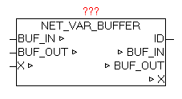

<!--
  Copyright (c) 2026 Hans Mühlbauer, Franz Höpfinger and others.

  This program and the accompanying materials are made available under the
  terms of the Eclipse Public License 2.0 which is available at
  https://www.eclipse.org/legal/epl-2.0

  SPDX-License-Identifier: EPL-2.0
-->

## NET_VAR_BUFFER

| | |
|:---|:---|
| **Type	Function module** |  |
| **IN_OUT	X** | NET_VAR_DATA (NET_VAR data structure) |
| **BUF_IN** | ARRAY [1..64] OF BYTE (input data buffer) |
| **BUF_OUT** | ARRAY [1..64] OF BYTE (output data buffer) |
| **OUTPUT	ID** | BYTE (ID) |
| | The module NET_VAR_BUFFER is used for bidirectional transmission of 64 bytes from the master to slave and vice versa. The data from BUF_IN be recorded and passed on the other side (other plc) on the same module at the same position as BUF_OUT. |
| | Simultaneously, the input data on the opposite side (other control) is passed here as BUF_OUT again. |
| | ID parameter indicates the current identification number of the module instance. If the configuration of the master and the slave program is differently (incorrectly) that ID number is passed as a fault in the module NET_VAR_CONTROL. |

