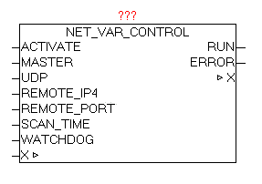

<!--
  Copyright (c) 2026 Hans Mühlbauer, Franz Höpfinger and others.

  This program and the accompanying materials are made available under the
  terms of the Eclipse Public License 2.0 which is available at
  https://www.eclipse.org/legal/epl-2.0

  SPDX-License-Identifier: EPL-2.0
-->

## NET_VAR_CONTROL

| | |
|:---|:---|
| **Type	Function module** |  |
| **IN_OUT	X** | NET_VAR_DATA (NET_VAR data structure) |
| **INPUT	ACTIVATE** | BOOL (Enables the exchange of data) |
| **MASTER** | BOOL (FALSE = SLAVE / MASTER = TRUE) |
| **UDP** | BOOL (FALSE=TCP / TRUE = UDP) |
| **REMOTE_IP4** | DWORD (IP4-address of the other SPS) |
| **REMOTE_PORT** | WORD (PORT number of other PLC) |
| **SCAN_TIME** | TIME (update time) |
| **WATCHDOG** | TIME (monitoring time) |
| **OUTPUT	RUN** | BOOL (active data exchange - no error) |
| | ERROR  DWORD ((error code) |
| | The module NET_VAR_CONTROL coordinates the data exchange between the two controllers and the satellite components NET_VAR_*. With ACTIVATE = TRUE, the data exchange will be released. The module must be invoked on both controllers, with the parameter MASTER must be assigned once with TRUE and once must be FALSE. Thus determines which side the active connection will establish. With UDP (FALSE / TRUE) can be specified whether a UDP or TCP connection is used. The the IP address of the other side must be specified in REMOTE-IP4, and alternatively, the port address (default port is 10000). The SCAN TIME determines a data refresh interval (default is T # 1s). WIth WATCHDOG the monitoring time is set (default is T # 2s). When data exchange runs, the parameter RUN = TRUE. If the data exchange is longer than the watchdog time not possible, RUN = FALSE and an error is passed. The error will not be acknowledged, because the module  automatically tries to restore the data exchange. Once no more error exists, RUN = TRUE and the error code is cleared. |
| **ERROR** | (regarded as a HEX value!) |

| DWORD | Message Type | Description |
| --- | --- | --- |
| B3 | B2 | B1 | B0 |  |  |
| XX | .. | .. | .. | Connection establish | Connect Error - See module IP_CONTROL |
| .. | XX | .. | .. | Send data | Transmission error   - See module IP_CONTROL |
| .. | .. | XX | .. | Receive data | Receive Error   - See module IP_CONTROL |
| .. | .. | .. | XX | Configuration error | ID number of the module |
