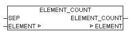

<!--
  Copyright (c) 2026 Hans Mühlbauer, Franz Höpfinger and others.

  This program and the accompanying materials are made available under the
  terms of the Eclipse Public License 2.0 which is available at
  https://www.eclipse.org/legal/epl-2.0

  SPDX-License-Identifier: EPL-2.0
-->

## ELEMENT_COUNT

| | |
|:---|:---|
| **Type	Function** | INT |
| **Input	SEP** | BYTE (separation character of the elements) |
| **I / O	ELEMENT** | STRING(ELEMENT_LENGTH) (input list) |
| **Output** | INT (number of items in the list) |
| | ELEMENT_COUNT determines the number of items in a list. |
| | If the parameter ELEMENT is an empty string 0 is passed as result. If at least one character is in ELEMENT it is evaluated as a single element and ELEMENT_COUNT = 1 is passed to output. |

**Example:**

Examples:

ELEMENT_COUNT('0,1,2,3',44) = 4

ELEMENT_COUNT('',44) = 0

ELEMENT_COUNT('x',44) = 1
